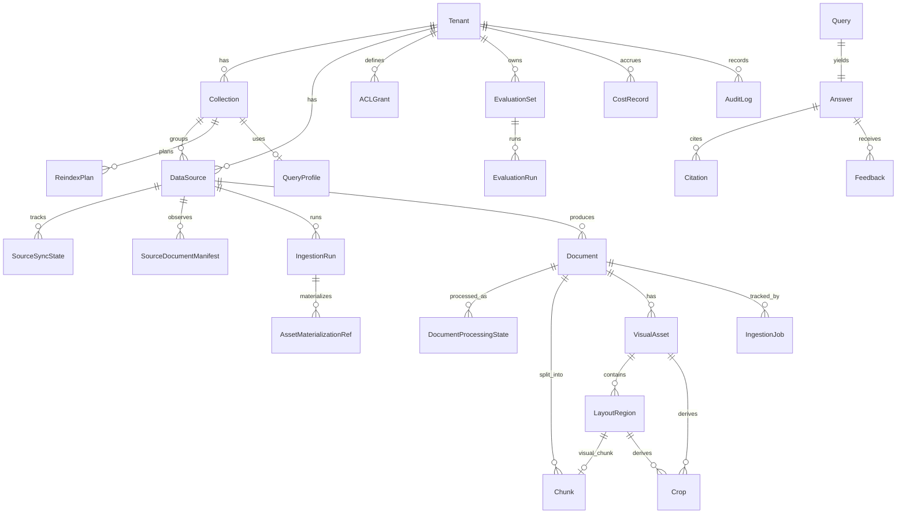

# Phase 1 Data Model: Generic RAG Platform

**Feature**: `001-rag-platform` | **Date**: 2026-06-18 | **Source**: [spec.md](./spec.md) Key Entities

設計原則: 全行に `tenant_id`（ハード分離境界, FR-021）。ACL は deny-by-default。検索系テーブルは
`tombstone`/`deleted_at` を必須フィルタにできるよう索引化。実装は PostgreSQL + pgvector を想定
（VectorStore は抽象、下記は MVP の物理モデル）。

---

## Entities

### Tenant
データ分離の最上位境界。
- `tenant_id` (PK), `name`, `status`, `created_at`, `updated_at`
- 設定: `default_query_profile_id`, `cost_budget`（tenant 単位）, `retention_policy`
- 関係: 1—N Collection / DataSource / Document / EvaluationSet / AuditLog

### Collection (Project)
tenant 内のサブグルーピング（ACL/コスト/設定のスコープ）。
- `collection_id` (PK), `tenant_id` (FK), `name`, `query_profile_id`, `cost_budget`,
  `sync_schedule`, `stale_tolerance`, `created_at`, `updated_at`

### DataSource
取り込み元定義。
- `source_id` (PK), `tenant_id`, `collection_id`, `type`（upload | object_storage |
  future:slack/confluence）, `config`(JSON), `sync_schedule`, `last_synced_at`, `status`

### Document
取り込み単位。
- `document_id` (PK), `tenant_id`, `collection_id`, `source_id`, `source_document_id`
- `version`, `checksum` / `content_checksum`, `metadata`(JSON), `metadata_schema_version`(int, default 1; ADR-015), `created_at`, `updated_at`, `indexed_at`
- `tombstone` (bool) / `deleted_at` — **検索クエリの必須フィルタ**
- `status`: `pending | parsing | chunking | embedding | indexed | failed | tombstoned`
- `pii_tags`, `secret_tags`（取り込み時分類; FR-024）
- 関係: 1—N Chunk / IngestionJob; N—M ACLGrant（scope=document）

### Chunk
検索単位（document の ACL を継承）。
- `chunk_id` (PK), `tenant_id`, `document_id` (FK), `collection_id`
- `modality`: `text | visual`（[CR] visual の場合は `region_id` を参照）
- `text`(正規化), `token_count`, `position`, `heading_path`
- `offset_mapping`（正規化↔原文の code point/grapheme 対応; FR-003b）
- `metadata`(JSON), `metadata_schema_version`(int, default 1; ADR-015), `embedding_model_version`
- `embedding`（pgvector; 無い場合は検索対象外）
- `tombstone`（document から伝播）

### VisualAsset [CR: 画像RAG]
ページ画像/画像（object storage 保存）。document のライフサイクルに従う。
- `asset_id` (PK), `tenant_id`, `document_id` (FK), `collection_id`
- `page`, `storage_uri`(object storage), `thumbnail_uri`, `mime_type`
- `checksum`, `version`, `width`, `height`, `metadata`(JSON), `metadata_schema_version`(int, default 1; ADR-015)
- `tombstone`（document から伝播）, ACL は document 継承

### LayoutRegion [CR: 画像RAG]
visual chunk の**正本**（retrieval 対象）。VisualAsset 内のレイアウト領域。
- `region_id` (PK), `tenant_id`, `asset_id` (FK), `document_id`, `collection_id`
- `page`, `bounding_box`（正規化座標 0–1, 解像度非依存）, `type`(text|figure|table|chart|screenshot|form|caption)
- `heading_path`, `ocr_text`, `ocr_confidence`
- `pii_tags`, `secret_tags`（画像内PII; FR-043）
- `visual_embedding`（pgvector）, `embedding_model_version`, `target_type`(layout_region)
- captioning（optional, FR-046）: `generated_caption_text`, `caption_model`,
  `caption_status`(not_requested|pending|succeeded|failed|skipped), `caption_confidence`(任意),
  `caption_generated_at`, `caption_redaction_status`, `caption_error_reason`(任意)
  — `region_type=caption`（レイアウト種別）とは区別。caption は検索補助のみ、一次根拠にしない（FR-048）
- `tombstone`（document から伝播）, ACL は document 継承

### Crop [CR: 画像RAG]
VisualAsset / LayoutRegion から生成される derived artifact（VLM 確認・citation 表示用）。
- `crop_id` (PK), `tenant_id`, `asset_id` (FK), `region_id`(任意), `document_id`, `collection_id`
- `bounding_box`, `crop_uri`(object storage), `page`
- ACL・redaction policy・deletion policy・`tenant_id`/`collection_id` を元 asset/region から**継承**（FR-052）
- `tombstone`（元 asset/region から伝播）

### Embedding（canonical, エンティティ化しない）[CR]
独立した MultimodalEmbedding は作らない。各ベクタは `modality`(text|visual) と
`target_type`(text_chunk | visual_asset | layout_region | ocr_text | generated_caption) を持ち、
`embedding_model_version` で版管理。

### IngestionJob
互換/API 表示用のジョブ投影。新規 pipeline status の正本は `IngestionRun` /
`DocumentProcessingState` とし、`IngestionJob` は既存 API 互換または軽量タスク表示に使う。
- `job_id` (PK), `tenant_id`, `source_id`, `document_id?`, `ingestion_run_id?`
- `type`: `ingest | reindex | sync | delete | evaluation | kpi_materialization`
- `status`: `queued | running | succeeded | failed | dead_letter | canceled`
- `failure_reason`, `retry_count`, `attempts[]`, `started_at`, `finished_at`, `dagster_run_id?`

### SourceSyncState
source 単位の同期カーソルと最新状態。NestJS admin API / App admin UI はこの状態を読む。
- `sync_state_id` (PK), `tenant_id`, `collection_id`, `source_id`
- `cursor` / `watermark`, `last_observed_at`, `last_successful_sync_at`, `last_started_at`
- `last_manifest_checksum`, `last_ingestion_run_id`, `status`: `idle | queued | observing | syncing | failed`
- `last_error`, `retry_count`, `sync_schedule`, `created_at`, `updated_at`

### SourceDocumentManifest
source observation の結果。差分検知と tombstone 即時反映の正本。
- `manifest_id` (PK), `tenant_id`, `collection_id`, `source_id`
- `source_document_id`, `source_uri`, `etag`, `last_modified`
- `content_checksum`, `approval_metadata_checksum`
- `deleted_in_source`, `observed_at`
- インデックス: `(tenant_id, collection_id, source_id, source_document_id, observed_at)`

### DocumentProcessingState
document 単位の詳細処理状態。Dagster asset は粗粒度に保ち、詳細はここに保存する。
- `processing_state_id` (PK), `tenant_id`, `collection_id`
- `document_id`, `source_document_id`, `content_checksum`
- `parser_version`, `chunking_config_version`, `embedding_model_version`
- `parse_status`, `chunk_status`, `embedding_status`, `index_status`
- `last_indexed_at`, `last_error`, `dagster_run_id?`
- status 値: `not_required | pending | running | succeeded | failed | skipped`

### IngestionRun
source sync / ingest / reindex / backfill / cleanup / evaluation の app-facing run。
- `ingestion_run_id` (PK), `tenant_id`, `collection_id`, `source_id?`, `requested_by?`
- `type`: `scheduled_sync | manual_sync | upload_ingest | reindex | backfill | cleanup | evaluation | kpi_materialization`
- `trigger`: `schedule | manual | source_observation | api | migration`
- `status`: `queued | running | succeeded | failed | canceled | partially_succeeded`
- summary: `observed_count`, `changed_count`, `deleted_count`, `skipped_count`, `failed_count`
- `started_at`, `finished_at`, `last_error`, `dagster_run_id?`, `dagster_run_url?`（内部運用者向け）

### AssetMaterializationRef
Dagster materialization と app state の参照。source of truth ではなく traceability 用。
- `asset_ref_id` (PK), `tenant_id`, `collection_id`, `ingestion_run_id`
- `dagster_asset_key`, `partition_key`, `dagster_run_id`, `materialization_event_id?`
- `storage_uri?`, `metadata`(JSON), `created_at`

### ReindexPlan
parser/chunking/embedding 変更や backfill の計画。Dagster backfill の入力になる。
- `reindex_plan_id` (PK), `tenant_id`, `collection_id`, `source_id?`
- `reason`: `parser_version_change | chunking_config_change | embedding_model_change | manual | recovery`
- `target_parser_version?`, `target_chunking_config_version?`, `target_embedding_model_version?`
- `scope`(JSON: source/document filter), `affected_document_count`, `status`: `planned | running | succeeded | failed | canceled`
- `dagster_backfill_id?`, `created_by`, `created_at`, `started_at`, `finished_at`, `last_error`

### QueryProfile
検索・回答の挙動設定（collection 単位で適用、query で上書き可）。
- `profile_id` (PK), `tenant_id`
- `score_threshold`, `top_k`, `minimum_evidence_count`
- `rerank_enabled`, `rerank_top_n`, `query_rewrite_enabled`
- `self_eval_enabled`, `self_eval_criteria`
- `embedding_provider`, `llm_provider`, `llm_model`（cheaper model 選択; FR-033）

### IdentityClaims (value object, 非永続)
呼び出しアプリが署名付きトークンで表明、基盤が検証して principal を構築。
- `tenant_id`, `user_id`, `groups[]`, `roles[]`, `exp`, `signature`

### ACLGrant
deny-by-default の許可レコード。
- `grant_id` (PK), `tenant_id`
- `scope_type`: `tenant | collection | document`, `scope_id`
- `subject_type`: `user | group | role`, `subject_id`
- `permission`: `read`（MVP）
- インデックス: `(tenant_id, scope_type, scope_id, subject_type, subject_id)`

### Query / Answer
- Query: `query_id`, `tenant_id`, `principal`(claims), `text`, `profile_id`, `created_at`
- Answer: `answer_id`, `query_id`, `tenant_id`, `text?`, `status`（ok | insufficient_evidence
  | budget_exceeded | temporarily_unavailable）, `confidence`, `used_chunks[]`,
  `freshness`(indexed_at/document_version), `cost`(tokens)

### Citation
回答が参照した根拠（実際に引用した chunk のみ）。
- `citation_id`, `answer_id`, `tenant_id`
- `kind`: `text | visual`
- `document_id`, `chunk_id`, `source_id`, `version`
- text: `text_range`（原文上の code point / grapheme オフセット）, `retrieval_score`
- [CR] visual（VisualCitation 別エンティティは作らず Citation(kind=visual)）:
  `image_id`/`asset_id`, `page_number`, `region_id`, `bbox`, `crop_uri`, `ocr_text`(あれば),
  `retrieval_score`

### EvaluationSet / EvaluationRun
- EvaluationSet: `eval_set_id`, `tenant_id`, `items[]`(question, expected_answer,
  expected_evidence[]) — 登録時 PII/secret scrub 必須
- EvaluationRun: `run_id`, `eval_set_id`, `tenant_id`, `baseline`(bool), `metrics`(recall@k,
  citation_accuracy, groundedness, p95_latency, query_cost), `security_checks`(acl_leak,
  deleted_reappearance, tenant_isolation, unauthorized_context → 全て pass 必須), `created_at`

### Feedback
- `feedback_id`, `tenant_id`, `answer_id`, `subject`(user | eval_job), `rating`, `comment`,
  `created_at`

### CostRecord / Budget
- CostRecord: `record_id`, `tenant_id`, `collection_id?`, `query_id?`, `kind`(llm_token |
  embedding_token | rerank | storage | indexing_job), `amount`, `created_at`
- Budget: tenant/collection/query 単位の上限（QueryProfile/Tenant/Collection に保持）

### AuditLog / Trace
- AuditLog: `log_id`, `tenant_id`, `timestamp`, `request_id?`, `trace_id?`, `correlation_id`
- Actor fields: `actor_id?`, `actor_role?`, `actor_group?`, `app_id?`, `api_client_id?`, `actor_type`(app | user | admin | worker)
- Action fields: `action`(authz_decision | data_access | ingest | parse | search | answer_generation |
  citation_access | delete | redaction | provider_policy_change | evaluation_run | kpi_export),
  `resource_type`, `resource_id?`, `decision`, `reason?`, `policy_version?`
- Evidence snapshot fields: `approval_status_at_use?`, `citation_ids[]?`, `document_ids_used[]?`,
  `chunk_ids_used[]?`, `retrieval_profile_id?`, `provider_policy_id?`
- Redaction/logging fields: `pii_redaction_applied`, `secret_redaction_applied`, `logging_policy_id?`,
  `raw_content_stored=false` by default
- Trace: OTel span（永続化せず exporter 経由）。`correlation_id` / `trace_id` で AuditLog と突合。

---


## Technical Stack Addendum: Provider / Retrieval / Logging / Jobs

### ProviderPolicy
Tenant/collection 単位で parser/OCR/LLM/embedding/rerank/observability provider の利用可否、residency、zero-retention/no-train capability、opt-in を制御する policy。
- `provider_policy_id` (PK), `tenant_id`, `collection_id?`, `name`, `status`
- `parser_mode`: `aws_only | azure_document_intelligence_allowed | google_document_ai_allowed | customer_managed_parser | oss_only`
- `allowed_parser_providers[]`, `allowed_llm_providers[]`, `allowed_embedding_providers[]`, `allowed_rerank_providers[]`
- `provider_regions`(JSON), `data_residency_requirement`, `cross_cloud_processing_allowed`
- `zero_retention_required`, `no_train_required`, `customer_opt_in_required`, `customer_opt_in_status`
- `provider_contract_refs[]`, `provider_capability_snapshot`(JSON), `fallback_policy`(JSON)
- `created_by`, `approved_by?`, `approved_at?`, `created_at`, `updated_at`

### RetrievalProfile
QueryProfile から参照される retrieval strategy の正本。初期は vector-only 禁止。
- `retrieval_profile_id` (PK), `tenant_id`, `collection_id?`, `name`, `version`, `status`
- `metadata_filter_required` (bool), `identifier_match_enabled` (bool), `identifier_fields[]`
- `keyword_match_enabled`, `keyword_strategy`: `postgres_fts | pg_bigm | pgroonga | opensearch | disabled`
- `vector_search_enabled`, `vector_top_k`, `vector_score_threshold`
- `rerank_enabled`, `rerank_provider`, `rerank_model`, `rerank_candidate_limit`, `final_context_limit`
- `exact_candidate_limit`, `hybrid_candidate_limit`, `minimum_evidence_count`
- `high_risk_required_evidence_policy_id?`, `fallback_behavior`: `insufficient_evidence | vector_only_disabled | temporarily_unavailable`
- `created_at`, `updated_at`

### LoggingPolicy
Langfuse / OTel / CloudWatch へ何を保存するかを tenant/collection 単位で制御する。
- `logging_policy_id` (PK), `tenant_id`, `collection_id?`, `name`, `status`
- `raw_user_query_storage`: `disabled | redacted | full_opt_in`
- `raw_retrieved_context_storage`: `disabled | redacted | full_opt_in`（default `disabled`）
- `model_input_storage`, `model_output_storage`: `disabled | redacted | full_opt_in`
- `store_citation_ids`, `store_chunk_ids`, `store_prompt_template_version`, `store_model_metadata`, `store_latency`, `store_cost`
- `production_sampling_rate`, `high_risk_trace_policy`, `pii_redaction_policy_ref`, `secret_redaction_policy_ref`
- `langfuse_project_ref?`, `retention_policy_ref`, `created_at`, `updated_at`

### EmbeddingJob
Embedding / reembedding / model migration の job 単位。SQS worker と Dagster backfill の両方から参照できる。
- `embedding_job_id` (PK), `tenant_id`, `collection_id`, `ingestion_run_id?`, `reindex_plan_id?`
- `document_id?`, `chunk_ids[]`, `embedding_provider`, `embedding_model_version`, `embedding_dimension`
- `chunking_config_version`, `status`: `queued | running | succeeded | failed | canceled | partially_succeeded`
- `queue_backend`: `sqs | dagster | manual`, `sqs_message_id?`, `dagster_run_id?`
- `input_token_count`, `embedded_count`, `failed_count`, `cost_record_id?`, `last_error?`
- `started_at`, `finished_at`, `created_at`

### RerankTrace
Rerank の candidate set と結果 metadata。LoggingPolicy に従い本文は保存しない。
- `rerank_trace_id` (PK), `tenant_id`, `query_id`, `answer_id?`, `retrieval_profile_id`
- `rerank_provider`, `rerank_model`, `candidate_count`, `final_count`
- `candidate_chunk_ids[]`, `selected_chunk_ids[]`, `scores`(JSON)
- `latency_ms`, `cost_record_id?`, `created_at`

### EvaluationRun Extension
既存 EvaluationRun に PoC benchmark と Ragas/custom eval の結果を追加する。
- `evaluation_run_id` / `run_id`, `tenant_id`, `eval_set_id?`, `benchmark_type`: `quality_gate | poc_stack_benchmark | regression | parser_benchmark`
- `industry_id?`, `document_sample_size`, `provider_policy_id?`, `retrieval_profile_id?`
- `parser_provider`, `embedding_provider`, `embedding_model_version`, `rerank_provider`, `llm_provider`
- metrics: `recall_at_5`, `recall_at_10`, `exact_code_lookup_success_rate`, `citation_accuracy`, `spreadsheet_cell_citation_accuracy`, `groundedness`, `insufficient_evidence_correct_rejection_rate`, `high_risk_gate_compliance`, `parser_table_structure_accuracy`, `p95_latency_ms`, `query_cost`
- hard gates: `acl_leakage_count`, `tenant_leakage_count`, `deleted_document_searchable_count`, `raw_context_logging_violation_count`
- `ragas_metrics`(JSON), `baseline_comparison`(JSON), `gate_result`, `created_at`

### ProviderConfigAuditEvent
ProviderPolicy / RetrievalProfile / LoggingPolicy / model config 変更の監査イベント。
- `provider_config_audit_event_id` (PK), `tenant_id`, `collection_id?`
- `event_type`: `provider_policy_changed | retrieval_profile_changed | logging_policy_changed | model_changed | parser_provider_changed | residency_override | opt_in_changed`
- `actor`, `before`(JSON redacted), `after`(JSON redacted), `reason`, `approval_ref?`
- `created_at`, `correlation_id`

### DocumentProcessingState extensions
既存 `DocumentProcessingState` に以下を追加する。
- `provider_policy_id?`, `parser_provider`, `parser_provider_region?`, `parser_artifact_uri?`
- `chunk_target_tokens`, `chunk_max_tokens`, `embedding_input_limit_tokens`
- `queue_backend`: `sqs | dagster | manual`, `sqs_message_id?`
- `logging_policy_id?`, `retrieval_profile_id?`

### SourceDocumentManifest extensions
既存 `SourceDocumentManifest` に以下を追加する。
- `provider_policy_id?`, `source_region?`, `parser_required?`, `external_parser_allowed?`
- `residency_classification`, `confidentiality_classification`

### IngestionRun extensions
既存 `IngestionRun` に以下を追加する。
- `queue_backend`: `sqs | dagster | manual`
- `provider_policy_id?`, `logging_policy_id?`, `retrieval_profile_id?`
- `sqs_message_id?`, `dlq_message_id?`, `retry_policy`(JSON)


## Phase 0/1 Lock Schema Additions (ADR-015)

これらの列は ADR-015 / OD-001 / OD-003 が要求し、後からの versioning / runtime editing が破壊的
migration にならないよう **最初の Phase 0/1 migration から存在させる**。runtime profile editing 自体は
Phase 0/1 では対象外（OD-001）。ここで足すのは storage / lifecycle 列のみ。

### JSONB metadata schema version (OD-003)
- `metadata_schema_version`(int, default 1) を全 JSONB metadata 列に付与: Document.metadata /
  Chunk.metadata / VisualAsset.metadata / LayoutRegion 業界 metadata。JSONB payload を検証する
  MetadataSchema の版を識別する。

### Policy/profile lifecycle fields (OD-001)
- `profile_version`, `schema_version`, `effective_from`, `deprecated_at` を、Phase 1 が seed する
  001 policy/config entity（**ProviderPolicy / RetrievalProfile / LoggingPolicy / QueryProfile**）に
  追加（additive、`*_version` は非null default、`effective_from`/`deprecated_at` は nullable）。
  既存 `version`/`status` と併存し、後から versioned / effective-dated config を破壊的 migration なしに
  足せるようにする。
- Phase 2 の 010 IndustryProfile / MetadataSchema / policy table も生成時に同じ4列を持つ
  （OD-001 Phase 2 follow-up / 010 ISF-001）。001 Phase 0/1 は 010 IndustryProfile を作らない。

### Hot-field promotion mechanism (OD-003 / ADR-011)
- 業界 metadata は JSONB のまま。頻出 hot field は expression index / generated column で昇格する。
  例: `document.metadata->>'document_type'` / `metadata->>'approval_status'` /
  `metadata->>'effective_date'` の expression index と、識別子 `equipment_id`/`property_id`/
  `unit_id`/`fund_id` の index（RetrievalProfile の metadata-exact filter と identifier/code match が
  消費; T088/T090）。検証する MetadataSchema(`indexed_fields`) は 010 framework（Phase 2）に置く。
  Phase 0/1 で配線するのは generic hot field（document_type / approval_status / effective_date）のみ。
  per-industry full normalization は Phase 3–5 に deferred。

## Relationships (ERD)



---

## State Transitions

### Document / IngestionJob
```
pending → parsing → chunking → embedding → indexed
   │         │          │           │
   └─────────┴──────────┴───────────┴──→ failed（理由保存・再実行可・非検索対象）
indexed → (削除要求) → tombstoned → (非同期物理削除) → purged
indexed → (再index/モデル変更) → 新version並行構築 → 切替 → 旧version tombstoned
```

### Source Sync / DocumentProcessingState
```
SourceSyncState: idle → queued → observing → syncing → idle
                              └──────────────→ failed（retry/backoff; last successful index は維持）

DocumentProcessingState:
parse_status/chunk_status/embedding_status/index_status = pending → running → succeeded | failed | skipped
```

### 差分判定ルール

- `content_checksum` が変わらなければ parse/chunk/embedding を再実行しない。
- `approval_metadata_checksum` だけ変わった場合は Document/Chunk metadata update と safety/index filter update のみ実行する。
- `parser_version` または `chunking_config_version` が変わった場合は reparse/rechunk する。
- `embedding_model_version` が変わった場合は reembedding/backfill 対象にする。
- source から削除された文書は `deleted_in_source=true` を観測した時点で tombstone とし、検索・回答・citation・cache から即時除外する。
- delete は Dagster の物理 cleanup を待たず、アプリ DB の tombstone で即時効かせる。

### Answer status
```
ok | insufficient_evidence | budget_exceeded | temporarily_unavailable
```

---

## Validation Rules（spec 由来）

- 全テーブルに `tenant_id` 必須。検索/回答は `tenant_id` ∧ `NOT tombstone` ∧ `acl_visible` を
  pre-filter（FR-021/022, R4）。

- ProviderPolicy は外部 cloud parser/OCR/LLM/embedding/rerank 利用前に必ず評価する。`cross_cloud_processing_allowed=false` の tenant では Azure/Google DI など外部 cloud parser へ raw files を送信してはならない。
- RetrievalProfile は vector-only を初期既定にしてはならない。metadata exact filter + identifier/code match + vector search + rerank の candidate union を基本とする。
- LoggingPolicy の default は raw retrieved context storage disabled。Langfuse/trace/log には citation IDs/chunk IDs/prompt template version/model metadata/latency/cost を保存し、本文は redaction または opt-in がある場合のみ保存する。
- Cohere Embed Multilingual v3 を使う RetrievalProfile/EmbeddingJob では chunk target 250-400 tokens、max 約450 tokens を default とし、超過時は chunking_config_version を更新して rechunk/reembed 対象にする。
- Aurora pgvector + RLS 実装では search/answer/admin/worker/reindex/evaluation すべてで tenant context を必須にし、RLS bypass role を application path で使ってはならない。

- Chunk は `embedding` が無ければ vector search 対象外（FR-030 Embedding 失敗時）。
- Citation は実際に引用した chunk のみ（FR-012）。used_chunks は全回答に必須（制約）。
- 差分同期は SourceDocumentManifest と DocumentProcessingState で判定する。`content_checksum` 不変なら parse/chunk/embedding を skip、`approval_metadata_checksum` のみ変化なら metadata/filter update のみ、`parser_version` / `chunking_config_version` 変化なら reparse/rechunk、`embedding_model_version` 変化なら reembedding/backfill。
- EvaluationSet 登録時 PII/secret scrub 必須（FR-024b）。
- 削除済み（tombstone/purged）は検索・回答・引用・キャッシュに再出現禁止（SC-003 hard gate）。
- [CR] VisualAsset/LayoutRegion も `tenant_id`＋document継承ACL を必須とし、同一 pre-filter で
  評価。削除は visual asset・OCRテキスト・region・visual embedding・サムネイル・cache をカスケード
  （FR-045）。visual citation・VLM入力にも再出現禁止（SC-009 hard gate）。
- [CR] OCR 信頼度が閾値未満の region は根拠採用しない/低減。`visual_embedding` 無い region は
  visual search 対象外（FR-030 の embedding 失敗時と同様）。
- [CR] captioning は optional（`caption_status` 既定 `not_requested`）。`generated_caption_text`
  は検索補助のみで一次根拠にしない（FR-048）。caption 失敗は ingestion 全体を failed にせず
  `caption_status=failed` 記録・再実行可（FR-050）。caption にも PII/secret redaction 適用（FR-049）。
- [CR] Crop は元 VisualAsset/LayoutRegion の tenant_id/collection_id/ACL/redaction/deletion を
  継承（FR-052）。権限外/削除済み crop は検索・回答・citation・thumbnail preview に出さない。
- [CR] 削除カスケードは document/visual asset/layout region/crop/OCR text/generated caption/
  visual embedding/thumbnail と、retrieval/answer/VLM response/visual answer/thumbnail/crop の各
  cache を無効化（FR-045）。削除済み visual artifact を含む cached answer は再利用禁止（SC-009）。
