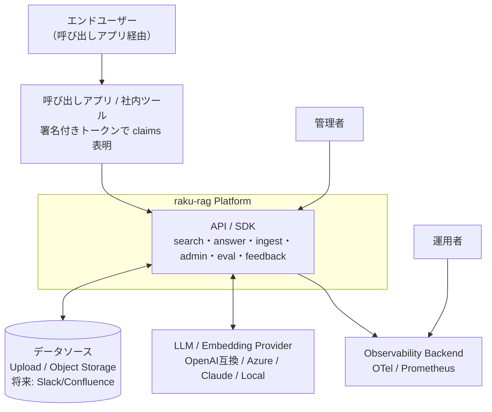

# Implementation Plan: Generic RAG Platform

**Branch**: `001-rag-platform` | **Date**: 2026-06-18 | **Spec**: [spec.md](./spec.md)

**Input**: Feature specification from `specs/001-rag-platform/spec.md`

## Summary

複数アプリから共通利用できる汎用RAG基盤を、**API First** のモジュラモノリスとして構築する。
非同期 ingestion/indexing pipeline、同期 search/answer API、admin API、evaluation runner、
横断的な observability を備える。connector/parser/chunker/embedding/vector store/reranker/
LLM をインターフェースで抽象化し（Constitution IV）、**ACL漏れ・削除済み再出現を最重要リスク**
として pre-filter と tombstone を構造的ゲートに据える。技術選択は research.md に集約
（Dagster / pgvector / OpenTelemetry / provider 抽象）。

**[CR: 画像RAG]** 画像・スキャンPDF・図表を含む文書のRAGを追加。OCR・layout/region 抽出・
visual embedding・VLM（Vision LLM）を 4 つの新インターフェースとして抽象化し、既存の retrieval/
answer 経路へ統合する。ACL pre-filter・tenant 分離・tombstone をテキストと同一機構で visual asset/
region にも適用し、最重要リスクを再利用で担保（research.md R10）。音声・動画は非ゴール。

## Technical Context

**Language/Version**: TypeScript (Node.js LTS) for the synchronous API/control surface, Python 3.12 for parser/OCR/embedding/evaluation workers, AWS CDK v2 in TypeScript for infrastructure.

**Primary Dependencies**:
- **API**: NestJS (critical synchronous path: search/answer/admin/eval/feedback), OpenAPI contract generation, Pydantic-compatible schema contracts where shared with Python workers.
- **Frontend**: Next.js + Vercel AI SDK for the web/admin/chat client. Hosting on Vercel is optional and must be gated by data residency requirements; AWS-hosted Next.js/CloudFront/ECS is the fallback.
- **Ingestion / evaluation workers**: Python 3.12 workers for parser/OCR/layout extraction, chunking, embedding jobs, evaluation, and offline benchmark harness.
- **Queue / orchestration**: SQS + DLQ for MVP worker execution. The data model remains compatible with Dagster for source sync, backfill, reindex, evaluation, and KPI materialization control plane. Step Functions may be used only for lightweight AWS-native workflows.
- **LLM**: Amazon Bedrock Claude. Sonnet is the default answer-generation model; Haiku-class models are used for query classification, metadata enrichment, summarization, captioning, and high-risk classification assistance.
- **Embedding**: Cohere Embed Multilingual v3 via Amazon Bedrock as the initial multilingual embedding option. Chunking must respect the model input limit; target chunks are 250-400 tokens, max around 450 tokens, with heading_path and metadata stored separately.
- **Rerank**: Cohere Rerank 3.5 via Amazon Bedrock. Rerank is applied to bounded candidate sets only, not every retrieved row.
- **Storage**: Aurora PostgreSQL Serverless v2 + pgvector + PostgreSQL RLS for app state, metadata, sync/processing state, audit, cost, and initial vector storage; S3-compatible Object Storage for raw files/parser artifacts; Redis-compatible cache where needed.
- **Auth**: Amazon Cognito with SAML/OIDC federation for B2B tenants.
- **Secrets / encryption**: AWS Secrets Manager + KMS, with future BYOK support.
- **Observability**: Langfuse self-hosted on ECS for LLM observability, CloudWatch/OpenTelemetry for platform traces and metrics. LoggingPolicy controls redaction, sampling, and whether raw prompts/context are stored.
- **Evaluation**: Ragas + custom hard-gate evaluation for recall@k, citation accuracy, groundedness, insufficient-evidence rejection, ACL/tenant leakage, parser structure accuracy, latency, and cost.
- **Infrastructure**: ECS Fargate + Aurora + SQS + S3 + Cognito + KMS, provisioned with AWS CDK TypeScript.

**Important Technical Corrections**:
1. Initial retrieval is **not vector-only**. It is metadata exact filter + identifier/code match + pgvector semantic search + Bedrock Cohere Rerank. Full Japanese BM25/形態素 hybrid search is evaluated later; if Aurora-supported extensions are insufficient, OpenSearch is the fallback.
2. Parser/OCR providers are controlled by `ProviderPolicy`. Azure Document Intelligence and Google Document AI are opt-in providers, not the default for strict AWS-only or residency-sensitive tenants. AWS-only and customer-managed parser paths must be available.
3. Bedrock Guardrails are defense-in-depth controls only. They must not replace tenant isolation, ACL pre-filter, RequiredEvidencePolicy, groundedness, domain RiskGate/SafetyGate, or DraftArtifact review.
4. Aurora pgvector + RLS requires tenant/collection-aware indexing, RLS policy tests, worker/admin tenant context propagation, and no application-path bypass role.
5. Langfuse must not store raw retrieved context by default. Store citation IDs, chunk IDs, prompt template versions, model metadata, latency, cost, and redacted inputs/outputs according to LoggingPolicy.
6. SQS worker is the MVP default. `SourceSyncState`, `SourceDocumentManifest`, `DocumentProcessingState`, `IngestionRun`, and `ReindexPlan` remain in the model so Dagster can be added for diff sync/backfill/reindex/evaluation/KPI without redesign.

**[CR] Visual/Image dependencies（すべて抽象越し）**: OCR エンジン（AWS-only/customer-managed/Azure Document Intelligence/Google Document AI/Tesseract 等）, layout/region 抽出, captioning provider（optional enrichment）, visual/multimodal embedding, VLM provider。具体実装は `providers/` に閉じ、上位は ProviderPolicy と interface に依存する。

**Testing**: unit/contract/integration/security suites. Security hard gates include ACL leakage = 0, tenant leakage = 0, deleted/tombstoned reappearance = 0, cross-tenant vector search leakage = 0, admin dashboard leakage = 0, worker/admin RLS context enforcement, high-risk required citation gates, and logging redaction checks.

**Target Platform**: AWS-first B2B SaaS, single region for MVP unless tenant ProviderPolicy or residency profile requires stricter deployment boundaries.

**Project Type**: BtoB SaaS web service: NestJS API + Python ingestion/evaluation workers + Next.js admin/chat client.

**Performance Goals**: Baseline-driven. Initial PoC evaluates recall@5/10, exact code lookup success, citation accuracy, spreadsheet cell citation accuracy, groundedness, insufficient-evidence rejection, high-risk gate compliance, ACL/tenant leakage, parser table structure accuracy, p95 latency, and query cost.

**Constraints**: ACL漏れゼロ・削除済み再出現ゼロを absolute hard gate（SC-003/SC-004）。LLM context は検索済み∧権限確認済みチャンクのみ。全回答に使用チャンク一覧を返す。ProviderPolicy により外部クラウド parser/OCR 利用、region、zero-retention/no-train capability、customer opt-in を明示する。

**Scale/Scope**: MVP は単一リージョン・モジュラモノリス寄り。NestJS API と Python worker は個別に水平スケール可能。Aurora pgvector は初期〜中規模の既定。OpenSearch/Qdrant 等は RetrievalProfile と VectorStore abstraction で将来評価する。

## Constitution Check

*GATE: Phase 0 前に必須。Phase 1 設計後に再評価。*

| # | 原則 | 計画での充足 | 状態 |
|---|------|------------|------|
| I | Groundedness First | 2段階ゲート（retrieval pre-gate＋post-generation evidence check）。根拠不足は `insufficient_evidence` を返す | ✅ |
| II | Traceability | 全 search/answer に source_id/document_id/chunk_id/version/retrieval_score。Citation エンティティで保証 | ✅ |
| III | Security by Design | tenant ハード分離・deny-by-default ACL・署名トークン検証・監査ログ・tombstone・redaction を初期設計に内包 | ✅ |
| IV | Pluggable Architecture | `interfaces/` に 8 抽象（Connector/Parser/Chunker/Embedding/VectorStore/Reranker/LLM/TaskQueue） | ✅ |
| V | Evaluation-Gated Delivery | EvaluationRunner＋CI/定期ジョブ。検索/生成=baseline relative、security=absolute hard gate | ✅ |
| VI | Observable by Default | OTel トレース＋Prometheus メトリクス＋構造化ログを 5 段階に付与 | ✅ |
| VII | API First | OpenAPI 契約を先行確定。admin も API。最小UIは後続 | ✅ |
| VIII | Data Lifecycle Complete | 作成/更新/差分同期/削除(tombstone+cascade)/再インデックス/バックアップ/ロールバック を設計 | ✅ |

**初期ゲート: PASS**（違反なし → Complexity Tracking 不要）。Phase 1 後の再評価は本ファイル末尾。

**[CR: 画像RAG] 再評価**: 画像対応の追加で原則 IV の抽象は 8→13（OcrEngine/LayoutExtractor/
CaptioningProvider/VisualEmbeddingProvider/VLMProvider 追加）。captioning は optional enrichment
で一次根拠にしないため Groundedness（I）を弱めない。原則 I/II/III/V/VI/VIII は既存機構
（pre-filter・tombstone・traceability・evaluation gate・observability）を画像モダリティへ拡張する
のみで、新たな違反・正当化すべき複雑性は無し。**PASS 継続**。

---

## Architecture

### Context Diagram（C4: System Context）



### Component Diagram（C4: Container/Component）

```mermaid
graph TB
  subgraph API[API Service（NestJS, 同期）]
    R_SEARCH[search router]
    R_ANSWER[answer router]
    R_INGEST[ingest router]
    R_ADMIN[admin router]
    R_EVAL[eval router]
    R_FB[feedback router]
    SEC[Security / Tenancy<br/>token検証・principal・ACL pre-filter]
  end

  subgraph SVC[Services（orchestration）]
    RETR[RetrievalService]
    ANS[AnswerService]
    ING[IngestionService]
    DEL[DeletionService]
    EVAL[EvaluationService]
    COST[CostService / Budget]
  end

  subgraph IFACE[interfaces/（抽象）]
    I_CONN[Connector]
    I_PARSE[Parser]
    I_CHUNK[Chunker]
    I_EMB[EmbeddingProvider]
    I_VEC[VectorStore]
    I_RERANK[Reranker]
    I_LLM[LLMProvider]
    I_TQ[TaskQueue]
    I_OCR[OcrEngine 〔CR〕]
    I_LAYOUT[LayoutExtractor 〔CR〕]
    I_CAPTION[CaptioningProvider 〔CR〕]
    I_VEMB[VisualEmbeddingProvider 〔CR〕]
    I_VLM[VLMProvider 〔CR〕]
  end

  subgraph DG[Dagster Control Plane（offline）]
    A_MANIFEST[source_manifest / changed_document_manifest]
    A_RAW[raw_document_artifacts]
    A_PARSE[parsed_document_elements / OCR / layout]
    A_CHUNK[chunks]
    A_EMB[embeddings]
    A_INDEX[vector_index_entries]
    A_EVAL[retrieval / answer quality checks]
    A_KPI[dashboard KPI materialization]
  end

  subgraph DATA[Persistence]
    PG[(PostgreSQL<br/>app state + metadata + sync/processing state)]
    OBJ[(S3互換 Object Storage<br/>raw files + parser artifacts)]
    VS[(Vector Store<br/>embeddings)]
    REDIS[(Redis: cache / lightweight queue)]
  end

  OBSV[Observability: logging/metrics/tracing + redaction]

  R_SEARCH --> SEC --> RETR --> I_VEC --> VS
  R_ANSWER --> SEC
  ANS --> RETR
  ANS --> I_RERANK
  ANS --> I_LLM
  RETR --> I_EMB
  R_INGEST --> ING --> PG
  PG --> DG
  A_MANIFEST --> I_CONN
  A_PARSE --> I_PARSE & I_OCR & I_LAYOUT
  A_CHUNK --> I_CHUNK
  A_EMB --> I_EMB & I_VEMB
  A_INDEX --> I_VEC --> VS
  A_RAW --> OBJ
  A_EVAL --> EVAL
  A_KPI --> PG
  R_ADMIN --> DEL --> I_VEC & PG & REDIS
  R_EVAL --> EVAL --> PG
  ANS --> COST --> REDIS
  API & SVC & DG -.-> OBSV
```




### Dagster Architecture（Document Pipeline Control Plane）

Dagster は **オンラインの search/answer API には入れない**。NestJS はユーザー向け API、
Q&A、admin、evaluation request、solution-layer の DraftArtifact/review/dashboard を担当し、
Dagster は文書取り込み・差分同期・parse/chunk/embedding/indexing・evaluation・KPI materialization の
**非同期 control plane** として使う。

**Dagster の責務**:
- source sync / source manifest observation / changed・deleted document detection
- raw document materialization（Object Storage へ raw files を保存）
- parsing、OCR / layout extraction where applicable、chunking、embedding
- vector index publish、reindex / backfill、embedding model migration backfill
- evaluation runs、retrieval/answer quality checks、manufacturing KPI materialization
- freshness / data quality checks、failed job visibility and retry orchestration

**Dagster を使わない責務**:
- user-facing search/answer synchronous path（NestJS + RetrievalService + VectorStore が担当）
- request time authorization decision（001 AclPolicy / tenant boundary が担当）
- DraftArtifact state transition itself、review workflow state machine itself
- audit log source of truth、tenant ACL source of truth（PostgreSQL が正本）

**Persistence boundary**:
- PostgreSQL: アプリ状態、document/chunk metadata、SourceSyncState、SourceDocumentManifest、
  DocumentProcessingState、IngestionRun、AssetMaterializationRef、ReindexPlan、approval/audit/cost、
  solution-layer DraftArtifact を保持する。
- Object Storage: raw files と parser artifacts（OCR/layout/normalized elements 等）を保持する。
- Vector Store: embeddings と index entry を保持し、検索時は tenant / ACL / tombstone pre-filter を必須適用する。

**Asset design**（粗粒度 asset）:
- `source_manifest`
- `changed_document_manifest`
- `raw_document_artifacts`
- `parsed_document_elements`
- `manufacturing_metadata_enriched_elements`（002 solution layer が hook を提供）
- `chunks`
- `embeddings`
- `vector_index_entries`
- `retrieval_quality_checks`
- `answer_quality_checks`
- `manufacturing_dashboard_metrics`（002 solution layer の KPI materialization）

Dagster asset は tenant / collection / source / sync_run など粗めの単位で定義し、document_id / chunk_id
単位の詳細状態は PostgreSQL の `DocumentProcessingState` に保持する。文書ごとに大量の Dagster asset を
作らない。Dagster materialization は `AssetMaterializationRef` として PostgreSQL に参照を保存し、App admin UI
は PostgreSQL の job/sync status を表示する。内部運用者向けに必要な場合のみ `dagster_run_id` / run URL を
表示し、end user に Dagster UI を直接見せない。

**Automation**:
- scheduled sync / manual sync / source observation sensor
- ingestion_job sensor（NestJS が PostgreSQL に作成した queued run を検知）
- failed job retry / backoff / dead-letter visibility
- embedding model migration backfill / reindex plan execution
- KPI daily materialization / evaluation scheduled run

**Quality checks**:
- embedding coverage
- chunk count > 0
- parser output schema valid
- spreadsheet citation cell_range valid
- deleted documents not searchable
- ACL leakage = 0
- tenant isolation leakage = 0
- high-risk approved citation requirement satisfied
- recall@k baseline regression check
- citation accuracy baseline regression check

**Step Functions との関係**: AWS-native な軽量 workflow には Step Functions を残してよい。ただし RAG document
pipeline の差分同期、backfill、lineage、quality check は Dagster を優先する。Lambda の 15 分制限に依存する
重い parse/OCR/embedding 処理は ECS/Fargate/worker/Dagster executor 側へ逃がす。

---

## Sequences

### Ingestion / Indexing Pipeline（Dagster control plane / 非同期）

```mermaid
sequenceDiagram
  participant Adm as 管理者/アプリ
  participant API as NestJS ingest/admin API
  participant DB as PostgreSQL
  participant DG as Dagster sensor/job
  participant Conn as Connector
  participant OBJ as Object Storage
  participant P as Parser/OCR/Layout
  participant Ch as Chunker
  participant Emb as EmbeddingProvider
  participant V as VectorStore

  Adm->>API: POST /v1/ingest or manual sync request
  API->>DB: create IngestionRun(status=queued), update SourceSyncState request
  API-->>Adm: 202 Accepted {ingestion_run_id, status_url}
  DG->>DB: observe queued IngestionRun / source schedule / source observation sensor
  DG->>Conn: list/fetch source manifest
  DG->>DB: upsert SourceDocumentManifest(observed_at, checksum, approval_metadata_checksum, deleted_in_source)
  DG->>DB: diff with DocumentProcessingState and tombstone deleted documents immediately
  Note over DG,DB: deleted_in_source=true は Document.tombstone を即時反映。物理 cleanup を待たない。
  DG->>OBJ: materialize raw_document_artifacts
  alt content_checksum unchanged
    DG->>DB: skip parse/chunk/embedding; refresh metadata/status only
  else content changed or parser/chunking version changed
    DG->>P: parse/OCR/layout extraction where applicable
    DG->>OBJ: store parser artifacts
    DG->>Ch: chunk with configured chunking_config_version
    DG->>Emb: embed chunks with embedding_model_version
    DG->>V: publish vector_index_entries (tenant/ACL/tombstone metadata)
    DG->>DB: update DocumentProcessingState(parse/chunk/embedding/index status, last_indexed_at, dagster_run_id)
  end
  alt approval metadata only changed
    DG->>DB: update Document/Chunk metadata and safety/index filters
    DG->>V: publish metadata/filter update without re-embedding
  end
  DG->>DB: write AssetMaterializationRef + IngestionRun summary
```


### Retrieval Strategy（AWS MVP）

初期検索は `vector-only` ではなく、以下の candidate union を RetrievalProfile で制御する。

1. metadata exact filter: tenant_id / collection_id / document_type / approval_status / effective_date / industry metadata。
2. identifier/code match: equipment_id, alarm_code, property_id, room_number, contract_id, fund_id, ISIN, invoice_id 等の normalized exact / prefix match。
3. pgvector semantic search: Cohere Embed Multilingual v3 の chunk size に合わせた短めの構造 chunk。
4. bounded rerank: vector top_k=50、metadata/code candidates=20 程度から最大 50-80 件を Cohere Rerank に渡し、final context は 5-12 件を目安にする。

Full Japanese BM25 / morphological hybrid search は PoC 評価後に追加する。Aurora PostgreSQL の拡張で足りない場合は OpenSearch を fallback とする。

### Query / Answer Pipeline（同期）

```mermaid
sequenceDiagram
  participant App as 呼び出しアプリ
  participant API as answer API
  participant Sec as Security/Tenancy
  participant Retr as RetrievalService
  participant V as VectorStore(pgvector)
  participant Rr as Reranker
  participant Gate as Groundedness Gate
  participant LLM as LLMProvider
  participant Cost as CostService

  App->>API: POST /v1/answer (query, signed token, query_profile)
  API->>Sec: verify token, build principal (user/groups/roles, tenant)
  Sec->>Cost: check budget (tenant/collection/query)
  alt budget 超過
    API-->>App: 200 {status: budget_exceeded}（推測回答しない）
  end
  API->>Retr: retrieve(query, principal, profile)
  Retr->>V: vector search WHERE tenant_id ∧ NOT tombstone ∧ acl_visible(principal)  %% pre-filter
  V-->>Retr: 権限確認済み候補チャンクのみ
  Retr->>Retr: post-check ACL (二重防御; 差分→fail-closed+alert)
  Retr->>Rr: rerank top_k（失敗時はrerankなしで閾値判定）
  Gate->>Gate: (a) pre-gate: score_threshold / minimum_evidence_count
  alt 根拠不足
    API-->>App: 200 {status: insufficient_evidence, used_chunks: []}
  else
    Gate->>LLM: generate(context = 権限確認済みチャンクのみ)
    LLM-->>Gate: draft answer
    Gate->>Gate: (b) post-generation evidence check（裏付けない主張は除外/縮小）
    API->>Cost: record cost (LLM/embedding/rerank token)
    API-->>App: 200 {answer, citations[doc/chunk/offset], confidence, used_chunks[], freshness}
  end
```

### Visual Ingestion & Answer（CR: 画像RAG）

```mermaid
sequenceDiagram
  participant W as Dagster asset/worker
  participant OBJ as Object Storage
  participant OCR as OcrEngine
  participant LAY as LayoutExtractor
  participant CAP as CaptioningProvider
  participant VEmb as VisualEmbeddingProvider
  participant V as VectorStore
  participant DB as metadata DB

  Note over W,DB: Ingestion（画像/スキャンPDF）
  W->>OBJ: store page images as VisualAsset (tenant_id, ACL継承, checksum)
  W->>OCR: OCR → text + confidence + bbox
  W->>LAY: layout/region 抽出 (text/figure/table/chart, bbox, page)
  opt captioning 有効時 (optional enrichment; tenant/collection/job/budget)
    W->>CAP: generated_caption_text（検索補助; 失敗は caption_status=failed のみ, ingest継続）
    Note over W,CAP: caption に PII/secret redaction 適用; 一次根拠にはしない
  end
  W->>VEmb: visual embedding（region/asset; target_type 記録）
  W->>V: upsert text+visual vectors (modality, acl, tombstone=false)[tx]
  W->>DB: upsert VisualAsset/LayoutRegion(+caption fields) + indexed_at[tx]

  participant App as アプリ
  participant Retr as RetrievalService
  participant VLM as VLMProvider
  Note over App,VLM: Answer（visual）
  App->>Retr: answer(query, token, profile)
  Retr->>V: マルチモーダル検索 WHERE tenant ∧ NOT tombstone ∧ acl_visible  %% pre-filter
  V-->>Retr: 権限確認済み text+visual 候補のみ
  Retr->>VLM: generate(権限確認済みの 元画像/crop/region を一次根拠; caption は検索補助のみ)
  VLM-->>App: answer + visual citations[asset_id,page_number,region_id,bbox,crop_uri,(OCR text)] + used_chunks
```

> caption は検索補助で一次根拠にしない。caption だけで裏付けできない場合は VLM が元画像/crop を確認
> （FR-048）。根拠不足判定（pre-gate + post-generation evidence check）と budget/障害時 fail-closed
> はテキスト経路と同一。VLM へ渡す画像・領域・crop は検索済み∧権限確認済みのみ（FR-040/052）。

---

## Permission Model（権限モデル）

- **principal**: 署名付きトークンの claims を検証して構築（`tenant_id`, `user_id`, `groups[]`,
  `roles[]`）。基盤は tenant/app/API client を認証、エンドユーザーのログインは持たない（FR-025）。
- **ACL grant**: `(scope_type ∈ {tenant, collection, document}, scope_id, subject_type ∈
  {user, group, role}, subject_id, permission ∈ {read})`。**deny-by-default**。
- **評価点**: retrieval SQL の WHERE で pre-filter（R4）。chunk は document の ACL を継承。
- **[CR] visual asset/region/crop/caption**: VisualAsset・LayoutRegion・Crop・generated caption・
  OCR text も document の ACL を継承し、同一 pre-filter（tenant ∧ NOT tombstone ∧ acl_visible）で
  評価。crop は元 asset/region の ACL/redaction/deletion を継承（FR-052）。VLM へ渡す画像・領域・crop
  は pre-filter 通過分のみ（VLM 前段で強制、self-eval は境界にしない）。
- **二重防御**: retrieval 後に各チャンクの ACL を再評価する assertion。差分検出時は fail-closed。
- **監査**: 認可判断・データアクセス・削除を AuditLog に記録（FR-023）。

---

## Deletion & Re-index Design

- **削除**: 受付即時に `Document.tombstone=true` → 全 retrieval クエリの必須フィルタで即時除外
  → カスケード物理削除（chunk→embedding→vector index→cache）は Dagster/worker/Step Functions 等の
  非同期 cleanup で実行し、job status は PostgreSQL の IngestionRun / DocumentProcessingState で追跡（FR-008）。
  検索・回答・citation・cache からの除外は物理 cleanup を待たず tombstone で即時効かせる。
- **キャッシュ無効化**: cache キーに `tenant_id` と `document_version` を含め、削除/更新で
  invalidate。tombstone を含む回答キャッシュは無効化。
- **再インデックス**: parser_version / chunking_config_version 変更時は reparse/rechunk、
  embedding_model_version 変更時は reembedding/backfill 対象にする。ReindexPlan を作成し、Dagster backfill で
  新バージョンを並行構築 → 切替（旧 version を tombstone）→ サービス継続。
- **バックアップ/ロールバック**: 復元後に deletion log / tombstone を再適用（FR-008a）。
- **[CR] visual カスケード**: 削除は VisualAsset・LayoutRegion・Crop・OCRテキスト・generated
  caption・visual embedding・サムネイル まで及び、retrieval/answer/VLM response/visual answer/
  thumbnail/crop の各 cache を無効化。tombstone 後は visual citation・VLM入力・thumbnail preview に
  再出現せず、削除済み visual artifact を含む cached answer は再利用しない（FR-045, SC-009）。
- **検証**: SC-003（再出現0件）と SC-009（visual 再出現/漏洩0件）を security スイートの hard gate に。

---

## Evaluation Design

- **EvaluationSet**: 質問・期待回答・期待根拠（chunk/doc）。PII/secret scrub を登録時必須チェック。
- **指標（MVP必須）**: recall@k, citation accuracy, groundedness, p95 latency, query cost。
  **[CR]** 画像対応時は **visual_recall@k / visual_citation_accuracy / bbox_iou /
  visual_groundedness / p95 visual answer latency / visual query cost** を baseline relative gate
  に組み込む（SC-008）。visual ACL漏洩（asset/crop/OCR/caption）・削除再出現・テナント分離違反は
  absolute hard gate（SC-009）。visual query cost は OCR/captioning/visual embedding/VLM image
  token を含む。
- **ゲート**:
  - 検索/生成/latency/cost = **baseline relative**（初回 run で baseline 確定、回帰ブロック）。
  - ACL漏洩 / 権限外チャンク混入 / 削除再出現 / テナント分離違反 = **absolute hard gate**。
- **実行**: CI ジョブ＋ Dagster scheduled evaluation run から `EvaluationRunner` を起動（FR-028, SC-006）。
  judge は `LLMProvider` 抽象越し（品質ゲート、権限境界にしない）。EvaluationRun と Dagster run は
  PostgreSQL の run_id / dagster_run_id で突合する。

---

## Monitoring Design

- **Tracing**: OpenTelemetry、相関ID を ingestion/indexing/retrieval/generation/evaluation に
  伝播（SC-005 トレース100%）。
- **Metrics**: 段階別 latency/throughput/error rate/cost を Prometheus 互換で公開（FR-017）。
- **Logging**: 構造化JSON、**redaction 必須**（PII/secret をログ・トレース・プロンプト保存・
  評価データ・エラー出力に残さない; FR-024a）。
- **アラート**: ACL post-check 差分、削除再出現検知、budget 超過、失敗ジョブ滞留、品質回帰。

---

## Error Handling 方針

原則 **fail-closed**（誤誘導する部分結果・推測回答を返さない）。指数バックオフ・DLQ・
サーキットブレーカーを `TaskQueue`/provider 呼び出しに適用（FR-030）。コンポーネント別:

| コンポーネント | 失敗時の既定動作 |
|---|---|
| Parser | document=failed＋理由保存、再実行可、未解析は検索対象外 |
| Embedding | リトライ後 job=failed、embedding 無い chunk は検索対象外 |
| VectorStore write | index 未完了扱い、metaDB↔index 整合を job status で追跡 |
| VectorStore read | 安全な fallback が無ければ回答せず `temporarily_unavailable` |
| Reranker | rerank なしで閾値/evidence を満たす時のみ続行、満たさねば不足/一時不可 |
| LLM | 回答生成せず `temporarily_unavailable`（retrieval だけで推測しない） |
| Connector | sync job=failed＋再実行可、last successful index は維持、freshness 反映 |
| [CR] OCR | リトライ後失敗は当該 asset の OCR を欠落として記録、visual embedding 検索は継続可、テキスト引用は付さない |
| [CR] LayoutExtractor | 失敗時はページ全体を 1 region にフォールバック、理由を記録 |
| [CR] Captioning | optional のため失敗で ingestion 全体を failed にしない。`caption_status=failed`＋理由を記録、再実行可。caption 欠落でも検索/回答は継続（caption は一次根拠でない） |
| [CR] VLM | 回答生成せず `temporarily_unavailable`（OCR/caption だけで推測しない） |
| Budget 超過 | `budget_exceeded`（根拠不足判定・ACL は弱めない） |

API レスポンス status: `ok` / `insufficient_evidence` / `budget_exceeded` /
`temporarily_unavailable`。

---

## Test Strategy

- **unit**: 各 interface 実装、chunker（日本語境界/offset）、ACL 評価、groundedness gate。
- **contract**: OpenAPI（schemathesis）でAPI契約、interface 抽象の契約テスト（実装差し替え検証）。
- **integration**: testcontainers（Postgres+pgvector/MinIO/Redis）で ingestion→search→answer。
- **security（hard gate, zero-tolerance）**:
  - ACL漏洩テスト: 権限外チャンクが retrieval/rerank/LLM context/citation に出ないこと（SC-004）。
  - 削除再出現テスト: tombstone/物理削除後に検索・回答・引用・キャッシュへ再出現しない（SC-003）。
  - テナント分離テスト: クロステナント検索が拒否される（FR-021a）。
  - [CR] visual 漏洩/削除テスト: 権限外 visual asset/region/crop/OCR text/generated caption が
    retrieval/rerank/VLM入力/visual citation/thumbnail preview に出ない、削除後に再出現しない
    （SC-009）。画像内 PII・EXIF・caption の redaction を検証。captioning は optional でも漏洩
    境界に影響しないことを確認。
- **eval**: EvaluationRunner を CI/定期で実行し baseline 比較。
- **observability**: トレース欠落ゼロ（SC-005）の検証。

CI 構成: lint/type → unit → contract → integration → **security hard gate** → eval gate。
security hard gate を通らない変更は baseline に関係なくマージ不可。

---

## Project Structure

### Documentation (this feature)

```text
specs/001-rag-platform/
├── plan.md              # This file
├── research.md          # Phase 0 output（技術選択）
├── data-model.md        # Phase 1 output（エンティティ詳細）
├── quickstart.md        # Phase 1 output（検証ガイド）
├── contracts/           # Phase 1 output（API & interface 契約）
│   ├── openapi.md
│   └── interfaces.md
└── tasks.md             # /speckit-tasks で生成（本コマンドでは作らない）
```

### Source Code (repository root)

```text
apps/
├── api/                 # NestJS API: search, answer, ingest, admin, eval, feedback
│   └── src/
│       ├── auth/        # Cognito/SAML/OIDC claims, API key auth, tenant context
│       ├── retrieval/   # RetrievalOrchestrator, RetrievalProfileService, identifier/code match
│       ├── answer/      # AnswerOrchestrator, CitationService, GroundednessService
│       ├── risk/        # RiskGate / SafetyGate / RequiredEvidencePolicy hooks
│       ├── admin/       # provider policy, retrieval profile, logging policy, jobs, eval
│       ├── observability/ # Langfuse/OTel/LoggingPolicy
│       └── cost/        # CostService / budget
├── web/                 # Next.js + Vercel AI SDK client/admin UI; hosting may be Vercel or AWS-hosted

workers/
├── ingest/              # Python 3.12 parser/OCR/layout/chunk/embed/index/eval workers
│   ├── providers/       # parsers, OCR/layout, embeddings, rerank helpers, parser provider adapters
│   ├── chunking/        # structure-aware Japanese chunking, table row/cell chunking
│   ├── queue/           # SQS + DLQ adapter, local adapter
│   └── eval/            # Ragas + custom hard-gate benchmark harness

packages/
├── shared/              # OpenAPI schemas, provider capabilities, policy DTOs, generated clients

infra/
├── cdk/                 # AWS CDK TypeScript: ECS Fargate, Aurora, SQS/DLQ, S3, Cognito, KMS, Langfuse
├── db/                  # SQL migrations / RLS policies / pgvector indexes

src/raku_rag/            # Legacy/generated Python package path if kept; treat as worker/eval implementation detail

specs/001-rag-platform/  # this feature docs

tests/
├── unit/
├── contract/
├── integration/
├── security/            # ACL漏洩・削除再出現・テナント分離・RLS・logging hard gates
└── benchmarks/          # PoC parser/retrieval/evaluation benchmark
```

**Structure Decision**: AWS-first monorepo。NestJS API が同期 online path を担当し、Python worker が parser/OCR/chunk/embedding/evaluation を担当する。`packages/shared` の contracts と provider capabilities で Principle IV を担保する。SQS worker を MVP default とし、Dagster は compatible state model を通じて future/offline control plane として追加可能にする。

**Service 責務と境界（services/）**:
- `apps/api/src/assets/crop.service.ts` / worker helper [CR]: crop / thumbnail / visual derived artifact の **生成**、元 VisualAsset/
  LayoutRegion からの **ACL継承・redaction継承**、削除対象としての管理（tombstone 連動）を担当。
- `apps/api/src/cache/cache.service.ts`: retrieval cache・answer cache・VLM response cache・visual answer cache・
  thumbnail cache・crop cache の **管理と invalidation** を担当。
- **責務境界**: `DeletionService` は tombstone 化とカスケード削除の**オーケストレーション**を行い、
  実際の cache 無効化は `CacheService` に、crop 物理削除は `CropService` に委譲する。
  `AnswerService`/`RetrievalService` は読み取り時に `CacheService` を参照（書き込み/無効化はしない）。
  これにより「削除→即時除外」の単一責任を DeletionService に集約し、再出現リスクを構造的に防ぐ。

---

## MVP → 将来拡張ロードマップ

- **M0 基盤**: tenancy/security/principal、metadata DB＋pgvector、interfaces 定義、observability。
- **M1 Ingestion（P1）**: SQS + Python worker による upload/object storage 取り込み、source manifest observation、
  差分同期、PDF/MD/HTML/text 正規化（日本語）、chunk＋offset、embedding、index、ingestion/sync status 管理
  （再実行/削除/再index/backfill）。状態モデルは Dagster-compatible に保つ。
- **M2 Search/Answer（P1）**: ACL pre-filter 検索、rerank、2段階 groundedness gate、引用付き回答、
  used_chunks、トレース。← **MVP の成立点（US1+US2）**。
- **M3 API/SDK（P2）**: OpenAPI 安定化、SDK、admin API、API バージョニング。
- **M4 Evaluation/Feedback（P2）**: EvaluationRunner、CI/定期ゲート、feedback 保存、baseline。
- **M5 運用監視（P3）**: メトリクス/ダッシュボード、アラート、コスト可視化。
- **[CR] M6 画像RAG（P2, US6）**: 画像/スキャンPDF 取り込み＋visual asset storage、OCR、layout/
  region 抽出、**captioning（optional enrichment）**、visual embedding、マルチモーダル retrieval
  （ACL pre-filter 再利用）、VLM 回答、visual citation（page/bbox/crop）、画像PII＋EXIF redaction、
  crop の ACL/削除継承、画像コスト粒度（OCR/captioning/visual embed/VLM image token 等）の算入、
  visual 評価指標群（recall@k/citation accuracy/bbox_iou/groundedness/latency/cost）。M2（検索/
  回答）成立後に着手し、既存のセキュリティ/削除/評価機構を画像へ拡張。caption は一次根拠にしない。
- **将来**: 外部SaaSコネクタ（Slack/Confluence）、hybrid search＋日本語 analyzer、Qdrant/
  OpenSearch 差し替え、共有マルチモーダル空間検索、absolute threshold gate 導入、最小 Admin UI、
  webhook/event-driven sync、音声・動画（現状は非ゴール）。

非ゴール（spec 準拠）: 独自LLM学習、全SaaSコネクタ、リアルタイム音声/動画RAG、人手レビューなしの
高リスク自動判断。

---

## Risks

| Risk | Impact | Mitigation |
|---|---|---|
| Dagster 運用コストと複雑性 | control plane、executor、run storage、sensors、backfill 運用が増え、MVP の運用負荷が上がる | MVP は coarse-grained assets と最小 sensor から開始し、document_id/chunk_id の詳細状態は PostgreSQL に寄せる。Dagster UI は内部運用者のみ |
| API status と Dagster run status の乖離 | admin UI が誤った進捗を表示し、再実行判断を誤る | PostgreSQL の IngestionRun / DocumentProcessingState を app-facing source of truth とし、Dagster run は AssetMaterializationRef と dagster_run_id で参照扱いにする |
| Asset 粒度の過剰細分化 | 文書数に比例して Dagster metadata DB が肥大化し、運用が重くなる | asset は tenant / collection / source / sync_run 粒度に限定し、文書単位詳細は PostgreSQL に保持する |
| 物理 cleanup 遅延 | Object Storage / Vector Store の物理削除が遅れ、削除済み文書が残存する | request path は PostgreSQL tombstone を必須 pre-filter とし、検索・回答・citation・cache から即時除外する。Dagster cleanup は最終整合 |
| Step Functions / worker / Dagster の責務混在 | workflow が分散して障害調査が難しくなる | RAG document pipeline の lineage/backfill/quality check は Dagster 優先、AWS-native 軽量 workflow のみ Step Functions 許容、重い parse/OCR/embedding は ECS/Fargate/worker/Dagster executor へ寄せる |
| External parser/OCR provider vs residency/no-train | Azure/Google DI を使うと strict AWS-only / residency tenant と衝突する | ProviderPolicy を tenant/collection 単位で必須化。default は AWS-only/customer-managed parser。Azure/Google は opt-in、region/no-train/zero-retention/contract mode を監査する |
| vector-only search misses identifiers | 型番・物件ID・契約ID・ISIN・ファンドコードなどが embedding で落ちる | RetrievalProfile で metadata exact + normalized identifier/code match + pgvector + rerank を初期採用。OpenSearch hybrid は評価後 fallback |
| Cohere Embed v3 chunk overflow | 512 token limit により長文 chunk が切れ、検索品質と citation が落ちる | chunk target 250-400 tokens、max 約450 tokens。heading_path/metadata は別保持、table は summary + row/cell chunks に分割 |
| Aurora pgvector + RLS query plan degradation | tenant filter + vector search + RLS で p95 が悪化する | tenant/collection partitioning、partial/HNSW index、RLS session variable、EXPLAIN hard test、OpenSearch/Qdrant fallback を準備 |
| Bedrock Guardrails overreliance | Guardrails を ACL/groundedness/risk gate の代替にしてしまう | Guardrails は defense-in-depth と明記。tenant isolation、ACL、RequiredEvidencePolicy、GroundednessGate、RiskGate、review を primary control とする |
| Langfuse raw context leakage | 顧客本文・機密 context が trace に残る | LoggingPolicy で raw context 保存を default off。citation IDs/chunk IDs/prompt version/model metadata/cost/latency を保存し、input/output は redaction/sampling |
| SQS-only operations become hard for backfill/reindex | 差分同期、再index、embedding migration、評価、KPI が増えると運用が重くなる | SQS を MVP default としつつ、SourceSyncState/Manifest/ProcessingState/IngestionRun/ReindexPlan を Dagster-compatible に保つ |
| Vercel hosting residency mismatch | フロント hosting の telemetry/region が顧客要件に合わない | Vercel AI SDK は採用可、hosting は ProviderPolicy/ResidencyProfile に従う。AWS-hosted Next.js を fallback |

## Constitution Check (Post-Design Re-evaluation)

Phase 1 設計（data-model / contracts / interfaces）反映後の再評価: **PASS**。
- pre-filter 設計と tombstone により ACL/削除の hard gate を構造的に担保（III, VIII）。
- `interfaces/` 8 抽象＋ provider 分離で差し替え可能性を確認（IV）。
- OpenAPI 契約と interface 契約を Phase 1 で先行確定（VII）。
- 新たな違反・正当化の必要な複雑性なし → Complexity Tracking 不要。
- **[CR: 画像RAG]** 5 抽象（OCR/Layout/Captioning/VisualEmbedding/VLM）の追加と visual asset/
  region/crop/caption の data-model・契約反映後も、ACL/削除/評価/観測の機構を再利用するのみで原則
  違反なし。captioning は optional・非一次根拠で Groundedness を弱めない → **PASS 継続**、
  Complexity Tracking 不要。
