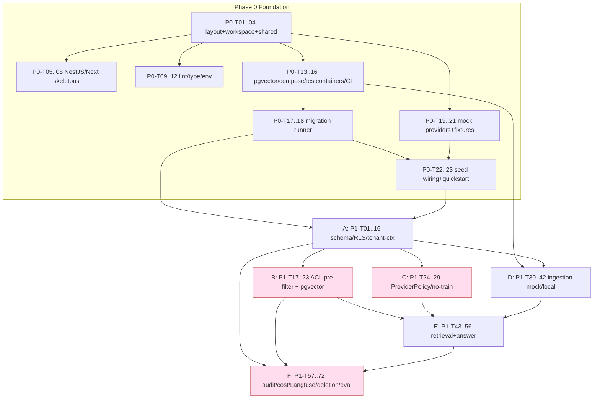

# Tasks: Generic RAG Platform

**Input**: Design documents from `specs/001-rag-platform/`

**Prerequisites**: plan.md, spec.md (required); research.md, data-model.md, contracts/, quickstart.md

**Tests**: spec/plan が security hard-gate・contract・評価ゲートを明示要求するためテストタスクを含む。

**Organization**: User Story 単位。canonical 語 = **collection**（=project）, **VisualAsset / LayoutRegion / Citation(kind=visual)**, 生成キャプションは **generated_caption_text**（`region_type=caption` と区別）。

## Format: `[ID] [P?] [Story] Description`

- **[P]**: 並列可（別ファイル・依存なし）／ **[Story]**: US1〜US6（Setup/Foundational/Polish は無し）／ 各タスクにファイルパス

## Path Conventions

AWS-first BtoB SaaS（plan.md）: `apps/api/` (NestJS), `apps/web/` (Next.js), `workers/ingest/` (Python 3.12), `packages/shared/`, `infra/cdk/`, `tests/`。既存 `src/raku_rag/` 記載は Python worker/evaluation package へ読み替え、実装計画で最終パスを確定する。

---

# Phase 0/1 Execution Plan (roadmap-scoped — ADR-015)

このセクションは **roadmap Phase 0（local-first foundation）+ Phase 1（001 production-adapter MVP）** の
実行ビュー。下の User-Story タスク（T001–T111）は詳細 backlog として残し、本プランの各タスクは
`→Txxx` でそれにマップする。**注意:** 下の `## Phase 1..Phase 10` 見出しは SpecKit の story phase であって
roadmap phase ではない。多くの `[X]` 済みタスク（stdlib core）は本プランの一部を既に満たすので再実装しない。

凡例: `[kind · est · →maps · RT]` / kind=setup|test|impl / 🔒 = security hard-gate test（baseline 不問・
merge 必須・PASS 必須）/ RT は末尾の Required-Tests 表に対応 / TDD: 各 impl の直前に対応 test を置く。

決定ロック（ADR-015）反映済み: core 正規化 / 業界 metadata=JSONB+`metadata_schema_version` /
hot field は expression-index・generated-column で昇格 / Langfuse は raw retrieved context をデフォルト非保存 /
runtime profile editing は対象外・policy/config に `profile_version`/`schema_version`/`effective_from`/`deprecated_at`。

## Phase 0 — Local-First Foundation

> **Implementation status (2026-06-19, host-verified):** Phase 0 implemented and verified.
> - **✅ verified (Python `unittest` + Node `npm`):** P0-T01–T12, T16–T23. Python suite **37 pass /
>   2 skip** (US6 + docker-gated); `npm install` (673 pkgs) → `build:shared` + `typecheck`
>   (api/web/shared = **0 TS errors**) + `test:api` (**NestJS e2e 7/7**, app boots) + `next build`
>   (web) all green; worker `--smoke` boots; migration runner idempotent; 5 mock providers deterministic.
> - **🟡 Docker-host-only (no Docker daemon in this env):** P0-T13, T14, T15 — `infra/docker-compose.yml`
>   (+ pgvector init + LocalStack queue bootstrap) is written and statically valid (YAML + bash syntax
>   OK); `tests/integration/test_stack_boot.py` runs on a Docker host. P0-T16 CI yaml validated and its
>   constituent commands all pass locally; full GH Actions run executes on push/PR (Python 3.12).
> All 23 tasks have real artifacts; nothing stubbed-empty.

- **P0-T01** [setup · 0.5d · →T002] 正準 monorepo layout を pin + ADR-016（src/raku_rag duality 解消）
  Files `docs/decisions/ADR-016-canonical-layout.md`, `implementation-roadmap.md` · Acc 既存 src/raku_rag 各 subpkg に正準 dest、5 skeleton root（apps/api, apps/web, workers/ingest, packages/shared, infra）を列挙 · Test doc-review checklist · Deps —
- **P0-T02** [test · 0.5d · →T002] workspace/layout invariants（fail-first）
  Files `tests/unit/test_repo_layout.py`, `tests/conftest.py` · Acc 5 root + tests/{unit,contract,integration,security} の存在、workspace manifest の workspaces 宣言を assert、初期は RED · Test `pytest tests/unit/test_repo_layout.py` · Deps P0-T01
- **P0-T03** [impl · 1d · →T002] root JS/TS workspace + workers/ingest Python pkg（src/raku_rag 再配置/alias）
  Files `package.json`, `pnpm-workspace.yaml`, `workers/ingest/pyproject.toml`, `workers/ingest/raku_rag/` · Acc raku_rag が workers/ingest からも import 可、既存 test 緑のまま、worker entrypoint stub · Test 既存 suite + P0-T02 緑 · Deps P0-T02
- **P0-T04** [impl · 1d · →T002] packages/shared 契約（search/answer/ingest DTO + policy 型に ADR-015 lifecycle fields）
  Files `packages/shared/src/dto/*`, `packages/shared/src/policy/*` · Acc `tsc --noEmit` 緑、DTO が openapi.md 形状一致、各 policy 型に profile_version/schema_version/effective_from/deprecated_at · Test tsc + apps からの型 import smoke · Deps P0-T03
- **P0-T05** [test · 0.5d · →T020] NestJS skeleton boot + `/v1` + mock auth middleware stub（fail-first）
  Files `apps/api/test/*.e2e-spec.ts` · Acc `GET /v1/health`=200、非/v1=404、Bearer 無し=401、X-User-Token→principal（tenant_id/user/groups/roles）、初期 RED · Test NestJS e2e (jest/supertest) · Deps P0-T04
- **P0-T06** [impl · 1d · →T020] NestJS API skeleton + `/v1` versioning + mock auth + tenant-context stub
  Files `apps/api/src/main.ts`, `apps/api/src/auth/` · Acc P0-T05 緑、mock API key + X-User-Token 検証、principal を request context へ · Test P0-T05 · Deps P0-T05
- **P0-T07** [test · 0.5d · →T002] Next.js + Vercel AI SDK client 配線（fail-first）
  Files `apps/web/` test · Acc app build/boot、AI SDK client が @shared 型を解決、初期 RED · Test web build/e2e smoke · Deps P0-T04
- **P0-T08** [impl · 1d · →T002] Next.js web skeleton + AI SDK client · Files `apps/web/` · Acc P0-T07 緑、@shared 消費 · Test P0-T07 · Deps P0-T07
- **P0-T09** [setup · 1d · →T003] lint/format/type: ruff+black+mypy（Py）/ eslint+prettier+tsc（TS）
  Files root + per-pkg config · Acc 全 pkg で lint/type 緑、CI lint stage が消費 · Test `ruff/mypy/tsc` 実行 · Deps P0-T03,P0-T04,P0-T06,P0-T08
- **P0-T10** [setup · 0.5d · →T003] pre-commit hooks（ruff/black/mypy + eslint/prettier + secret guard）
  Files `.pre-commit-config.yaml` · Acc commit 時に lint+secret-scan、bypass 不可既定 · Test pre-commit run --all · Deps P0-T09
- **P0-T11** [test · 0.5d · →T006 · RT13] env config + LoggingPolicy raw-context-disabled 既定（fail-first）
  Files `tests/unit/test_config_logging_default.py` · Acc 既定 LoggingPolicy で raw_retrieved_context_storage=disabled を assert、初期 RED · Test pytest · Deps P0-T03
- **P0-T12** [impl · 0.5d · →T006 · RT13] `.env.example` + shared config module 配線
  Files `.env.example`, `src/raku_rag/core/config.py` · Acc P0-T11 緑、raw-context 既定 disabled · Test P0-T11 · Deps P0-T11
- **P0-T13** [impl · 0.5d · →T004 · RT3] pgvector 有効 Postgres init image/script（local+CI）
  Files `infra/db/postgres/` · Acc `CREATE EXTENSION vector` 成功、CI で再現 · Test pgvector ext probe · Deps P0-T01
- **P0-T14** [impl · 1d · →T004 · RT1] docker-compose local stack（Postgres+pgvector / MinIO / LocalStack SQS / Langfuse-or-mock / Redis）
  Files `docker-compose.yml`, `infra/` · Acc `docker compose up` で全依存起動、必須 trace sink 含む · Test compose config + boot · Deps P0-T13
- **P0-T15** [test · 1d · →T004 · RT1,RT3] testcontainers conftest + compose-boot & pgvector-ext smoke（fail-first）
  Files `tests/conftest.py`, `tests/integration/test_stack_boot.py` · Acc postgres/minio/localstack/trace-sink fixtures、pgvector ext 検出、trace-sink reachable、初期 RED · Test pytest（requires_docker marker）· Deps P0-T14
- **P0-T16** [test→impl · 1d · →T005 · RT1] CI pipeline（lint→unit→contract→integration→🔒security-hard-gate→eval-gate）
  Files `.github/workflows/ci.yml` · Acc stage 順序を contract test、security gate は blocking · Test CI structure test + dry-run · Deps P0-T15,P0-T09
- **P0-T17** [test · 0.5d · →T008 · RT2] migration runner idempotent（fail-first）
  Files `tests/integration/test_migration_runner.py` · Acc apply→record→再 apply は no-op、初期 RED · Test pytest · Deps P0-T13
- **P0-T18** [impl · 1d · →T008 · RT2] migration runner（discover/apply/record/idempotent + CLI）
  Files `infra/db/migrations/`, runner · Acc P0-T17 緑、framework のみ（full schema は Phase 1）· Test P0-T17 · Deps P0-T17
- **P0-T19** [test · 0.5d · →T009 · RT12] mock-provider 適合性 suite（deterministic・interface-conformant、fail-first）
  Files `tests/unit/test_mock_providers.py` · Acc 各 mock が interface 準拠・決定的、no-train 能力を露出（auditable）、初期 RED · Test pytest · Deps P0-T01
- **P0-T20** [impl · →T009,T027–T029] deterministic mock providers — **5 sub-task（各 0.5d）に分割**: MockEmbedding / MockRerank(+skip fallback) / MockLLM / MockGuardrail(defense-in-depth, ACL/evidence 迂回不可) / MockAuth(+signed-claim generator)
  Files `src/raku_rag/providers/**/mock_*.py` · Acc P0-T19 緑、決定的出力 · Test P0-T19 · Deps P0-T19
- **P0-T21** [impl · 1d · →T009] local fixtures: parser(PDF/DOCX/XLSX/CSV/text+日本語)/ACL/eval/industry（image/scanned-PDF fixtures は US6 visual-RAG へ deferred）
  Files `tests/fixtures/` · Acc 決定的、tenant/collection/document/group/role ACL fixtures、expected evidence/rejection · Test fixture loader unit · Deps P0-T01
- **P0-T22** [setup · 0.5d · →T006] seed loader + mock+seed+fixtures を local default wiring へ登録
  Files `src/raku_rag/app.py`, seed loader · Acc idempotent・tenant-scoped・deny-by-default、RT17/RT18 の土台 · Test seed loader contract · Deps P0-T05,P0-T18,P0-T20,P0-T21
- **P0-T23** [setup · 0.5d · →new] 正準 monorepo の README / quickstart 更新
  Files `README.md`, `specs/001-rag-platform/quickstart.md` · Acc `compose up`→migrate→seed→mock answer の手順 · Test doc-review · Deps P0-T06,P0-T08,P0-T22

## Phase 1 — 001 Production-Adapter MVP

### Workstream A — Schema / migrations / RLS / tenant-context

- **P1-T01** [test · 0.5d · →T008,T091 · RT2,RT3] migration runner + pgvector ext bootstrap（fail-first）
  Files `tests/integration/test_migrations_pgvector.py` · Acc runner 適用後 ext あり、初期 RED · Test pytest(requires_docker) · Deps P0-T18
- **P1-T02** [impl · 0.5d · →T008,T091 · RT2,RT3] migration tooling + `0000_extensions`
  Files `infra/db/migrations/0000_extensions.sql` · Acc P1-T01 緑 · Test P1-T01 · Deps P1-T01
- **P1-T03** [test · 0.5d · →T008 · RT2] contract: ADR-015 lock 列の存在（fail-first）
  Files `tests/contract/test_lock_columns.py` · Acc `metadata_schema_version`（Document/Chunk/VisualAsset/LayoutRegion）と policy lifecycle 4 列が無ければ FAIL、初期 RED · Test pytest · Deps P1-T02
- **P1-T04** [impl · 1d · →T008 · RT2] migration: Tenant / Collection / DataSource（全行 tenant_id）
  Files `infra/db/migrations/0001_core.sql` · Acc 正規化 core、tenant_id NOT NULL · Test P1-T01 · Deps P1-T02
- **P1-T05** [impl · 1d · →T008 · RT2] migration: Document / DocumentElement(LayoutRegion) / Chunk + `metadata_schema_version`
  Files `0002_documents.sql` · Acc tombstone/deleted_at 索引、metadata JSONB + schema_version 既定 1 · Test P1-T03（一部緑）· Deps P1-T03,P1-T04
- **P1-T06** [impl · 1d · →T008,T019 · RT2,RT3] migration: Embedding-on-chunk(pgvector) + Citation
  Files `0003_embeddings_citations.sql` · Acc embedding は別 entity 化せず chunk/region 上、ivfflat/hnsw index · Test P1-T01 · Deps P1-T05
- **P1-T07** [impl · 1d · →T008 · RT2,RT14] migration: ACL / audit / cost / ingestion-state tables
  Files `0004_acl_audit_cost_state.sql` · Acc ACLGrant/AuditLog/CostRecord/IngestionRun/DocumentProcessingState、raw_content_stored 既定 false · Test P1-T01 · Deps P1-T05
- **P1-T08** [impl · 1d · →T008 · RT2] migration: policy/config entities + ADR-015 lifecycle 列
  Files `0005_policies.sql` · Acc ProviderPolicy/RetrievalProfile/LoggingPolicy/QueryProfile に profile_version/schema_version/effective_from/deprecated_at · Test P1-T03（緑）· Deps P1-T03,P1-T04
- **P1-T09** [impl · 0.5d · →T008 · RT2] hot-field expression index + identifier index（ADR-015 promotion）
  Files `0006_hot_field_indexes.sql` · Acc `metadata->>'document_type'`/`approval_status`/`effective_date` + equipment_id/property_id/unit_id/fund_id の index · Test index 存在 + 使用 explain · Deps P1-T05
- **P1-T10** [test · 1d · →T092 · RT4,RT5] 🔒 RLS tenant isolation + cross-tenant vector search = 0（fail-first）
  Files `tests/security/test_rls_pgvector.py` · Acc tenant A が tenant B の chunk を検索/取得不可、漏洩 0、初期 RED · Test pytest · Deps P1-T06,P1-T07
- **P1-T11** [impl · 1d · →T091,T092 · RT4,RT5] RLS policies + 非 bypass application role
  Files `0007_rls.sql` · Acc `app.current_tenant_id` session context、application path に bypass role 無し、P1-T10 緑 · Test P1-T10 · Deps P1-T10,P1-T08
- **P1-T12** [test · 0.5d · →T012,T092 · RT4] worker tenant-context DB session helper（fail-first）
  Files `tests/integration/test_worker_tenant_ctx.py` · Acc session が tenant_id 未設定だと検索 0、初期 RED · Test pytest · Deps P1-T11
- **P1-T13** [impl · 0.5d · →T012,T021b · RT4] worker tenant-context session manager
  Files `src/raku_rag/persistence/session.py` · Acc 全 worker クエリで tenant context 必須 · Test P1-T12 · Deps P1-T12
- **P1-T14** [test · 0.5d · →T012,T020 · RT4] NestJS tenant-context middleware（fail-first）
  Files `apps/api/test/tenant-context.e2e-spec.ts` · Acc principal→DB session の tenant 伝播、初期 RED · Test e2e · Deps P1-T11
- **P1-T15** [impl · 0.5d · →T012,T020 · RT4] NestJS tenant-context middleware impl
  Files `apps/api/src/tenancy/` · Acc P1-T14 緑 · Test P1-T14 · Deps P1-T14
- **P1-T16** [impl · 0.5d · →T008 · RT2,RT4] seed: tenant/collection/API key/ACLGrant + 既定 policy/profile
  Files seed · Acc tenant-scoped・deny-by-default、no-train 既定 policy 投入 · Test seed contract + P1-T10 · Deps P1-T08,P1-T11

### Workstream B — ACL pre-filter + pgvector VectorStore

- **P1-T17** [test · 0.5d · →T011 · RT6] ACLGrant deny-by-default contract（fail-first）
  Files `tests/unit/test_acl_deny_default.py` · Acc grant 無し=不可視、初期 RED（既存 stdlib AclPolicy で一部緑の可能性）· Test pytest · Deps —
- **P1-T18** [impl · 0.5d · →T011 · RT6] deny-by-default AclPolicy 検証（visibility predicate / assert_visible）
  Files `src/raku_rag/core/security/acl.py` · Acc P1-T17 緑 · Test P1-T17 · Deps P1-T17
- **P1-T19** [test · 0.5d · →T019,T092 · RT5] pgvector VectorStore: ACL+tenant+tombstone pre-filter contract（fail-first）
  Files `tests/contract/test_vectorstore_prefilter.py` · Acc 候補生成段階で除外（post-filter 不可）、初期 RED · Test pytest · Deps P1-T06,P1-T11
- **P1-T20** [impl · 1d · →T019 · RT5,RT6] pgvector VectorStore adapter: ACL+tenant+tombstone を SQL WHERE で PRE-filter
  Files `src/raku_rag/providers/vectorstores/pgvector.py` · Acc 検索 SQL/index 分離で境界、P1-T19 緑 · Test P1-T19 · Deps P1-T19
- **P1-T21** [test · 0.5d · →T025 · RT7,RT8] 🔒 権限外 doc が rerank 候補にも LLM context にも入らない（fail-first）
  Files `tests/security/test_acl_leak.py` · Acc denied chunk が result/rerank/LLM/citation に不在、初期 RED · Test pytest · Deps P1-T20
- **P1-T22** [impl · 0.5d · →T026 · RT7,RT8] RetrievalService 二重防御（pre-filter + post-check）配線
  Files `src/raku_rag/services/retrieval.py` · Acc P1-T21 緑、pre-filter を主防御に · Test P1-T21 · Deps P1-T21,P1-T20
- **P1-T23** [test · 0.5d · →T025b · RT5] 🔒 cross-tenant rejection + 存在秘匿（404 相当）
  Files `tests/security/test_tenant_isolation.py` · Acc tenant_id mismatch token/collection 拒否、エラーで存在を漏らさない · Test pytest · Deps P1-T20,P1-T11

### Workstream C — Governance policies (ProviderPolicy / no-train; LoggingPolicy は F)

- **P1-T24** [test · 0.5d · →T087 · RT11,RT12] 🔒 ProviderPolicyService が opt-in 無しの外部 cloud provider を拒否（fail-first）
  Files `tests/contract/test_provider_policies.py` · Acc AWS-only 既定で Azure/Google DI 拒否、初期 RED · Test pytest · Deps P1-T08,P1-T25
- **P1-T25** [setup · 0.5d · →T086 · RT11] no-train / zero-retention 既定 ProviderPolicy を seed（P1-T24 の前提 fixture）
  Files seed · Acc 既定 policy 行が no_train_required=true・zero_retention_required=true で存在、auditable · Test seed-contract assertion（既定 policy 行の存在 + no-train flag；P1-T24 とは独立）· Deps P1-T08
- **P1-T26** [impl · 1d · →T086 · RT11,RT12] ProviderPolicyService（no-train/allowlist/opt-in/residency/fallback）
  Files `apps/api/src/provider-policy/`, `workers/ingest/provider_policy.py` · Acc 外部 cloud 送信前に評価、`cross_cloud_processing_allowed=false` で raw files 送信不可、P1-T24 緑 · Test P1-T24 · Deps P1-T24
- **P1-T27** [impl · 1d · →T104 · RT11,RT12] ProviderConfigAuditEvent repo + 変更時 emission（redacted before/after）
  Files `src/raku_rag/persistence/provider_config_audit.py` · Acc policy/model 変更が監査される · Test audit integration · Deps P1-T24
- **P1-T28** [impl · 0.5d · →T087 · RT12] ProviderPolicy admin API（GET/PUT/validate）+ audit 配線
  Files `apps/api/src/admin/provider-policies.controller.ts` · Acc 変更で ProviderConfigAuditEvent 発火 · Test contract · Deps P1-T26,P1-T27
- **P1-T29** [test · 1d · →T103 · RT11,RT12] ParserProviderPolicy enforcement e2e（residency/no-train/opt-in/fallback）
  Files `tests/integration/test_parser_provider_policy.py` · Acc opt-in 無し外部 parser へ raw file 送信不可、fallback 動作、provider config audit · Test pytest · Deps P1-T26

### Workstream D — Ingestion (mock / local)

- **P1-T30** [setup · 1d · →T004] local ingestion infra bring-up（MinIO + LocalStack SQS + pgvector）integration harness
  Files `tests/integration/conftest_ingest.py` · Acc queue/bucket/db 自動構築 · Test harness smoke · Deps P0-T14
- **P1-T31** [setup · 0.5d · →T009] shared ingestion job message + idempotency-key 契約
  Files `packages/shared/src/ingest/job.ts`, `src/raku_rag/workers/queue/` · Acc job message に idempotency_key/tenant/source/document · Test contract · Deps P0-T04
- **P1-T32** [test · 0.5d · →T042] ingest job 作成→LocalStack SQS enqueue + queued state（fail-first）
  Files `tests/integration/test_ingest_enqueue.py` · Acc enqueue + IngestionRun queued、初期 RED · Test pytest · Deps P1-T30,P1-T31
- **P1-T33** [test · 1d · →T035] parser-fixture ingestion → elements → chunks → mock-embed → index（fail-first, +日本語）
  Files `tests/integration/test_ingest.py` · Acc PDF/MD/HTML/text→indexed、初期 RED · Test pytest · Deps P1-T30,P1-T31
- **P1-T34** [test · 1d · →T100 · RT15] 冪等再試行: 再配信 SQS message で重複 index 0（fail-first）
  Files `tests/integration/test_ingest_idempotent.py` · Acc idempotency_key で 1 回のみ index、初期 RED · Test pytest · Deps P1-T30,P1-T31
- **P1-T35** [test · 0.5d · →T036] 壊れ/未対応文書 → failed + 個別再実行（fail-first）
  Files `tests/integration/test_ingest_failure.py` · Acc failed 記録・理由・非検索・retry 可、初期 RED · Test pytest · Deps P1-T30,P1-T31
- **P1-T36** [impl · 1d · →T018] SQS TaskQueue adapter（LocalStack）+ DLQ + retry/backoff + circuit breaker
  Files `src/raku_rag/workers/queue/sqs.py` · Acc DLQ/再試行/idempotency、P1-T32/T34 緑 · Test P1-T32,P1-T34 · Deps P1-T32
- **P1-T37** [impl · 1d · →T039] raw-file Connector + MinIO object-storage adapter（upload / object_storage）
  Files `src/raku_rag/providers/connectors/` · Acc raw file を MinIO 保存・参照 · Test integration · Deps P1-T30
- **P1-T38** [impl · 1d · →T040] document element normalization（parser-output → DocumentElements, NFKC）
  Files `src/raku_rag/providers/parsers/` · Acc 構造化要素 + metadata_schema_version · Test P1-T33（一部）· Deps P1-T33
- **P1-T39** [impl · 1d · →T041] chunker（日本語境界 + offset_mapping + heading_path）
  Files `src/raku_rag/providers/chunkers/` · Acc 250–400 tok 既定、offset 正確 · Test P1-T33 · Deps P1-T38
- **P1-T40** [impl · 1d · →T043] mock embedding + pgvector upsert を単一 tx で
  Files `src/raku_rag/workers/ingestion.py` · Acc 部分失敗時 rollback、決定的 vector · Test P1-T33 · Deps P1-T30,P1-T39
- **P1-T41** [impl · 1d · →T042] ingestion job 作成サービス（IngestionRun/DocumentProcessingState projection）
  Files `src/raku_rag/services/ingestion.py` · Acc Document version/checksum 登録、状態投影 · Test P1-T32 · Deps P1-T32,P1-T36,P1-T37
- **P1-T42** [impl · 1d · →T043,T100 · RT15] Python SQS ingest worker runtime（consume→pipeline→state projection, idempotent）
  Files `workers/ingest/`, `src/raku_rag/workers/ingestion.py` · Acc P1-T33/T34/T35 緑、DocumentProcessingState 更新 · Test P1-T33,T34,T35 · Deps P1-T36,P1-T38,P1-T39,P1-T40,P1-T41

### Workstream E — Retrieval + Answer

- **P1-T43** [test · 0.5d · →T022 · RT9,RT10] contract: `/v1/search` & `/v1/answer` 応答形状（citation/used_chunks/freshness, fail-first）
  Files `tests/contract/test_search_answer.py` · Acc status enum、citation に document_id/chunk_id/range、初期 RED · Test pytest · Deps P0-T22
- **P1-T44** [test · 0.5d · →new] metadata exact filter が非一致 chunk を候補から除外（fail-first）
  Files `tests/integration/test_metadata_filter.py` · Acc filter 一致のみ候補、初期 RED · Test pytest · Deps P0-T22
- **P1-T45** [impl · 1d · →T026,T088] metadata exact filter（RetrievalService + VectorStore pre-filter）
  Files `src/raku_rag/services/retrieval.py` · Acc P1-T44 緑 · Test P1-T44 · Deps P1-T44
- **P1-T46** [test · 0.5d · →new] 正規化 identifier/code 完全一致 retrieval（fail-first）
  Files `tests/integration/test_identifier_match.py` · Acc equipment_id/property_id/contract_id/fund_id/ISIN 完全一致、初期 RED · Test pytest · Deps P0-T22
- **P1-T47** [impl · 1d · →T090] 正規化 identifier/code matching module
  Files `apps/api/src/retrieval/identifier-match.ts`（+ worker mirror）· Acc P1-T46 緑、P1-T09 の hot-field index を使用 · Test P1-T46 · Deps P1-T46,P1-T09
- **P1-T48** [test · 0.5d · →T028,T095 · RT7] reranker abstraction（mock deterministic + skip-on-fail, fail-first）
  Files `tests/contract/test_rerank.py` · Acc 決定的順序、失敗時 skip fallback、初期 RED · Test pytest · Deps P0-T22
- **P1-T49** [impl · 1d · →T028,T095 · RT7] bounded rerank abstraction + skip fallback（mock；Bedrock Cohere は deferred stub）
  Files `src/raku_rag/providers/rerankers/` · Acc candidate 50–80→final 5–12、RerankTrace 形状 · Test P1-T48 · Deps P1-T48
- **P1-T50** [test · 0.5d · →T088,T089] RetrievalProfile candidate union；vector-only 既定禁止（fail-first）
  Files `tests/contract/test_retrieval_profiles.py` · Acc metadata+identifier+vector+rerank union、vector-only=禁止、初期 RED · Test pytest · Deps P1-T45,P1-T47,P1-T49
- **P1-T51** [impl · 1d · →T088,T026] RetrievalProfileService（candidate union orchestration）
  Files `apps/api/src/retrieval/`, `src/raku_rag/services/retrieval.py` · Acc P1-T50 緑、fallback=insufficient_evidence · Test P1-T50 · Deps P1-T50
- **P1-T52** [test · 0.5d · →T030 · RT9] groundedness gate（pre-gate 閾値 + post-gen check, fail-first）
  Files `tests/integration/test_groundedness.py` · Acc 証拠不足は LLM 前に short-circuit、初期 RED · Test pytest · Deps P0-T22
- **P1-T53** [impl · 0.5d · →T030,T031 · RT9] groundedness gate hardening（pre-gate short-circuit + post-check）
  Files `src/raku_rag/services/groundedness.py` · Acc P1-T52 緑 · Test P1-T52 · Deps P1-T52
- **P1-T54** [test · 0.5d · →T023,T031 · RT10,RT17] e2e mock answer（retrieve→gate→mock LLM→citation / insufficient, fail-first）
  Files `tests/integration/test_mock_answer_e2e.py` · Acc 答えあり→引用付き、答えなし→insufficient_evidence、初期 RED · Test pytest · Deps P1-T51,P1-T53
- **P1-T55** [impl · 1d · →T031,T026 · RT9,RT10,RT17] AnswerService 配線（RetrievalProfile→citation/freshness/used_chunks/budget）
  Files `src/raku_rag/services/answer.py` · Acc 権限確認済み context のみ、P1-T54 緑 · Test P1-T54 · Deps P1-T54
- **P1-T56** [impl · 1d · →T032,T031b,T033 · RT9,RT10,RT17] `/v1/search` & `/v1/answer` handlers + freshness 応答
  Files `apps/api/src/search/`, `apps/api/src/answer/` · Acc P1-T43 緑、indexed_at/source_freshness/document_version 反映 · Test P1-T43,P1-T54 · Deps P1-T43,P1-T55

### Workstream F — Observability (audit/cost/trace) + deletion + eval

- **P1-T57** [setup · 0.5d · →T008 · RT14] AuditLog + CostRecord domain models（tenant_id/trace_id 必須）
  Files `src/raku_rag/domain/models.py` · Acc 必須 6 フィールド、raw_content_stored=false 既定、CostRecord.kind taxonomy · Test 属性 unit · Deps —
- **P1-T58** [test · 0.5d · →T034 · RT14] 🔒 audit event に tenant_id/actor_id/action/resource/decision/trace_id（fail-first）
  Files `tests/integration/test_audit_event.py` · Acc 6 フィールド非空、trace_id==correlation_id、cross-tenant read 0、初期 RED · Test pytest · Deps P1-T57
- **P1-T59** [impl · 1d · →T034 · RT14] AuditService（tenant-scoped, redacted, trace-correlated）
  Files `src/raku_rag/observability/audit.py` · Acc reason/resource を Redactor 経由、tenant filter、P1-T58 緑 · Test P1-T58 · Deps P1-T58
- **P1-T60** [test · 0.5d · →T021 · RT14] CostRecord persistence: kind taxonomy + tenant/collection/query/job 粒度（fail-first）
  Files `tests/unit/test_cost_record.py` · Acc 個別 record 永続化、無効 kind 拒否、集計=budget enforcement、初期 RED · Test pytest · Deps P1-T57
- **P1-T61** [impl · 0.5d · →T021 · RT14] CostService が CostRecord を永続化（kind/trace_id）budget 強制維持
  Files `src/raku_rag/services/cost.py` · Acc P1-T60 緑、would_exceed/budget_exceeded 不変 · Test P1-T60 · Deps P1-T60
- **P1-T62** [test · 0.5d · →T034 · RT14] answer/search/delete が audit emit + CostRecord 永続（fail-first）
  Files `tests/integration/test_answer_audit_cost.py` · Acc answer_generation audit + llm/embedding CostRecord + delete audit、insufficient/budget も decision 記録、初期 RED · Test pytest · Deps P1-T59,P1-T61
- **P1-T63** [impl · 1d · →T034 · RT14] audit+cost emission を Answer/Retrieval/Deletion へ配線
  Files `services/{answer,retrieval,deletion}.py` · Acc P1-T62 緑、raw 本文非保存、ACL/groundedness 不弱化 · Test P1-T62 · Deps P1-T62
- **P1-T64** [test · 0.5d · →T099 · RT13] 🔒 Langfuse が raw retrieved context を既定で保存しない（fail-first）
  Files `tests/security/test_logging_policy.py` · Acc trace に citation/chunk/document IDs/prompt-version/model/latency/cost あり・raw query/context 無し、should_store_raw=false、初期 RED · Test pytest · Deps P1-T57
- **P1-T65** [impl · 1d · →T098 · RT13] LoggingPolicyEnforcer + redacted Langfuse exporter（raw context 既定 disabled）
  Files `src/raku_rag/observability/{logging_policy,langfuse}.py` · Acc 既定 disabled、opt-in 時のみ raw、P1-T64 緑 · Test P1-T64 · Deps P1-T64
- **P1-T66** [impl · 0.5d · →T098 · RT13] LoggingPolicyEnforcer/Langfuse export を AnswerService trace emission へ配線
  Files `src/raku_rag/services/answer.py` · Acc trace_id==correlation_id、export 失敗で answer 壊さない（security は fail-closed のまま）· Test P1-T64 · Deps P1-T65,P1-T59
- **P1-T67** [impl · 0.5d · →T089,T098] RetrievalProfile/LoggingPolicy admin API（GET/PUT）+ audit 配線
  Files `apps/api/src/admin/` · Acc 変更で audit、LoggingPolicy 既定 raw-context disabled 維持 · Test contract · Deps P1-T51,P1-T65,P1-T27
- **P1-T68** [test · 0.5d · →T044,T037 · RT16] 🔒 deletion/tombstone cascade + cache-invalidation placeholder（fail-first）
  Files `tests/security/test_deletion_cascade.py` · Acc delete 後 tombstone 即時・検索 0・cache 無効・再 answer=insufficient、placeholder hook 呼出、初期 RED · Test pytest · Deps P1-T59
- **P1-T69** [impl · 0.5d · →T044 · RT16] DeletionService に cache-invalidation placeholder hook + delete audit
  Files `src/raku_rag/services/deletion.py` · Acc 即時 tombstone 維持、hook(tenant,document) 呼出、P1-T68 緑、既存 test_deletion_reappearance 緑のまま · Test P1-T68 · Deps P1-T68
- **P1-T70** [test · 0.5d · →T056,T057,T054 · RT18] eval smoke: text metrics + security checks on seed set（fail-first）
  Files `tests/integration/test_eval_smoke.py` · Acc recall@k/citation_acc/groundedness/p95/cost + 4 security_checks + gate_result、登録時 PII scrub、初期 RED · Test pytest · Deps P1-T57
- **P1-T71** [impl · 0.5d · →T056 · RT18] EvaluationSet/Run models + 登録時 PII/secret scrub
  Files `src/raku_rag/eval/models.py` · Acc Redactor scrub、security_checks dict、gate_result · Test P1-T70（一部）· Deps P1-T70
- **P1-T72** [impl · 1d · →T057 · RT18] EvaluationRunner smoke（text metrics + absolute security gate）
  Files `src/raku_rag/eval/runner.py` · Acc いずれかの security_check 失敗で gate_result=blocked（baseline 不問）、P1-T70 緑 · Test P1-T70 · Deps P1-T71,P1-T59,P1-T61

## Phase 0/1 Dependency Graph



Critical path: P0 foundation → A(schema/RLS) → B(ACL) → E(answer) → F(audit/trace/eval). 🔒security-hard-gate
tests（P1-T10/T21/T23/T24/T58/T64/T68）は対応 impl を gate し、baseline 不問で PASS 必須。

## Required-Tests Coverage (RT1–RT18)

| RT | 内容 | カバー task |
|----|------|------------|
| RT1 | docker compose boots | P0-T14, P0-T15, P0-T16 |
| RT2 | migrations run | P0-T17/18, P1-T01..T09, P1-T16 |
| RT3 | pgvector extension available | P0-T13, P0-T15, P1-T01, P1-T06 |
| RT4 | RLS tenant isolation | P1-T10, P1-T11, P1-T12..T15, P1-T16 |
| RT5 | cross-tenant vector search 0 leaks 🔒 | P1-T10, P1-T11, P1-T19, P1-T20, P1-T23 |
| RT6 | ACL pre-filter 🔒 | P1-T17, P1-T18, P1-T20 |
| RT7 | denied doc not to rerank 🔒 | P1-T21, P1-T22, P1-T48, P1-T49 |
| RT8 | denied doc not to LLM 🔒 | P1-T21, P1-T22 |
| RT9 | insufficient_evidence | P1-T43, P1-T52, P1-T53, P1-T54, P1-T55, P1-T56 |
| RT10 | citation has document_id/chunk_id/range | P1-T43, P1-T54, P1-T55, P1-T56 |
| RT11 | no-train default active | P1-T24, P1-T25, P1-T26, P1-T29 |
| RT12 | no-train config auditable | P0-T19, P1-T24, P1-T26, P1-T27, P1-T28, P1-T29 |
| RT13 | Langfuse no raw context by default 🔒 | P0-T11, P0-T12, P1-T64, P1-T65, P1-T66 |
| RT14 | audit event has tenant/actor/action/resource/decision/trace_id | P1-T07, P1-T57..T63 |
| RT15 | ingestion idempotent retry | P1-T34, P1-T42 |
| RT16 | tombstoned doc not searchable 🔒 | P1-T68, P1-T69 |
| RT17 | mock answer end-to-end | P1-T54, P1-T55, P1-T56 |
| RT18 | eval smoke runs | P1-T70, P1-T71, P1-T72 |

全 RT がカバー済み（gap なし）。

## Phase 0/1 Acceptance Checklist

Phase 0 exit:
- [ ] `docker compose up` で全 local 依存（Postgres+pgvector / MinIO / LocalStack SQS / trace sink）起動（RT1）
- [ ] migrations 適用（RT2）・pgvector extension 有効（RT3）
- [ ] deterministic mock providers で ingestion/search/answer contract test 実行可
- [ ] CI が lint→unit→contract→integration→🔒security-hard-gate→eval を blocking で実行

Phase 1 exit（security hard gate は 1 件でも fail で merge 不可）:
- [ ] 🔒 tenant leakage = 0（RT4）/ cross-tenant vector search 漏洩 = 0（RT5）
- [ ] 🔒 ACL pre-filter、denied chunk が rerank/LLM/citation に出ない（RT6/7/8）
- [ ] insufficient_evidence 正答（RT9）・citation に document_id/chunk_id/range（RT10）
- [ ] no-train 既定 active（RT11）かつ auditable（RT12）
- [ ] 🔒 Langfuse が raw retrieved context を既定保存しない（RT13）
- [ ] audit event に tenant_id/actor_id/action/resource/decision/trace_id（RT14）
- [ ] ingestion job 冪等再試行（RT15）・🔒 tombstoned document 非検索（RT16）
- [ ] mock answer end-to-end（RT17）・eval smoke 実行（RT18）

## Out-of-Scope for Phase 0/1（backlog にマップ）

- 010 runtime framework 本実装 → `specs/010-*`（Phase 2）
- 002/003/006 vertical slices → 各 spec（Phase 3–5）
- Dagster 実装 → T021a / T045a-c / T046 / T059 / T062a
- 実 Bedrock / Azure DI / Google DI / Textract / Cognito / OpenSearch → T093/T095/T096/T097/T101/T102/T106/T107（Phase 0/1 は mock/stub のみ）
- AWS 本番デプロイ → T101 · full web dashboard → US5 T060–T062
- 画像/VLM US6 answer path（実 provider）→ T063–T079
- DraftArtifact 業界テンプレート / 投資 compliance workflow → 010 / 006（Phase 2+）

## Pre-Implementation Blockers

**None — Phase 0 ready, Phase 1 defined.** decision-lock 監査は Critical/High = 0（remediation 済み）。
ADR-015 の schema_version / policy lifecycle fields / hot-field index は P1-T03/T05/T08/T09 で test-gated。

非 blocker の follow-up: (1) P0-T01 で canonical layout / `src/raku_rag` path duality を pin（監査 F8）;
(2) plan.md "8→13 abstracts" cosmetic（F9）; (3) 010 data-model lifecycle fields（ISF-001, Phase 2 deferred）。

## 次アクション

1. **/speckit-analyze 再実行（Phase 0/1 限定 read-only）= 推奨**（Prompt 3）— tasks↔spec/plan/data-model/contracts/ADR の整合・TDD 順・scope を検証。
2. **/speckit-implement = Phase 0 から**（Prompt 4）— analyze 通過後に Phase 0 のみ着手、Phase 1 は定義済み・未実装のまま。


## Phase 1: Setup (Shared Infrastructure)

- [X] T001 Create project structure `src/raku_rag/{api,core,domain,interfaces,providers,pipelines,services,workers,persistence,observability,eval}` と `tests/{unit,contract,integration,security}` per plan.md
- [ ] T002 Initialize monorepo: NestJS API (`apps/api`), Next.js + Vercel AI SDK client (`apps/web`), Python 3.12 ingest/eval worker (`workers/ingest`), shared contracts package, and CDK TypeScript app (`infra/cdk`)
- [ ] T003 [P] Configure lint/format/type (ruff, black, mypy) + pre-commit
- [ ] T004 [P] docker-compose + testcontainers: PostgreSQL+pgvector / MinIO(S3) / Redis / LocalStack SQS / Langfuse / optional Dagster dev services in `docker-compose.yml`, `tests/conftest.py`
- [ ] T005 [P] CI pipeline skeleton (lint→unit→contract→integration→**security hard gate**→eval gate) in `.github/workflows/ci.yml`
- [X] T006 [P] Environment configuration management in `src/raku_rag/core/config.py`

---

## Phase 2: Foundational (Blocking Prerequisites)

**⚠️ CRITICAL**: 完了まで User Story 着手不可

- [X] T007 Define domain schemas/value objects (Pydantic) in `src/raku_rag/domain/` (Tenant, Collection, DataSource, Document, Chunk[modality], VisualAsset, LayoutRegion[+caption fields], Crop, ACLGrant, QueryProfile, Query/Answer, Citation[kind], CostRecord/Budget, IdentityClaims)
- [ ] T008 Database models + migrations — 全テーブル `tenant_id` 必須、`tombstone`/`deleted_at` 索引、caption fields、crop、ACL/cost/audit テーブル、embedding `modality`/`target_type`、SourceSyncState / SourceDocumentManifest / DocumentProcessingState / IngestionRun / AssetMaterializationRef / ReindexPlan、ProviderPolicy / RetrievalProfile / LoggingPolicy / EmbeddingJob / RerankTrace / ProviderConfigAuditEvent。**ADR-015 lock additions**: `metadata_schema_version`(default 1) を Document/Chunk/VisualAsset/LayoutRegion の JSONB metadata に; `profile_version`/`schema_version`/`effective_from`/`deprecated_at` を ProviderPolicy/RetrievalProfile/LoggingPolicy/QueryProfile に; document_type/approval_status/effective_date + 識別子 hot field の expression-index/generated-column（data-model.md "Phase 0/1 Lock Schema Additions" 参照）。これらが欠落したら migration/contract test を FAIL させる
- [X] T009 [P] Define abstract interfaces in shared contracts / worker interfaces — **計13 provider抽象**: Connector, Parser, OcrEngine, LayoutExtractor, Chunker, CaptioningProvider, EmbeddingProvider, VisualEmbeddingProvider, VectorStore, Reranker, LLMProvider, VLMProvider, TaskQueue plus ProviderPolicyService, RetrievalProfileService, LoggingPolicyEnforcer, GuardrailsAdapter
- [X] T010 [P] Implement TokenVerifier (signed token → IdentityClaims) in `src/raku_rag/core/security/token.py`
- [X] T011 Implement AclPolicy (deny-by-default, tenant→collection→document 階層, `visibility_filter`, `assert_visible`) in `src/raku_rag/core/security/acl.py` (depends T009)
- [X] T012 Implement tenancy enforcement (tenant_id 伝播, クロステナント拒否) in `src/raku_rag/core/tenancy.py`
- [X] T013 [P] Implement Redactor (PII/secret 検出・分類・マスク; テキスト + 画像領域 + EXIF フック) in `src/raku_rag/observability/redaction.py`
- [X] T014 [P] Structured logging with mandatory redaction in `src/raku_rag/observability/logging.py` (depends T013)
- [ ] T015 [P] OpenTelemetry tracing (correlation_id 伝播) in `src/raku_rag/observability/tracing.py`
- [ ] T016 [P] Prometheus metrics in `src/raku_rag/observability/metrics.py`
- [X] T017 Error model + API status (`ok|insufficient_evidence|budget_exceeded|temporarily_unavailable`) in `src/raku_rag/core/errors.py`
- [ ] T018 TaskQueue adapter for SQS + DLQ + circuit breaker, with local/dev adapter, in `workers/ingest/queue/` and shared TaskQueue contract (depends T009)
- [X] T019 pgvector VectorStore: **ACL pre-filter + tombstone exclusion + tenant 分離 + modality 対応** in `src/raku_rag/providers/vectorstores/pgvector.py` (depends T008, T009, T011)
- [ ] T020 NestJS API app skeleton + `/v1` versioning + auth middleware (API key + `X-User-Token`) in `apps/api/src/main.ts` and `apps/api/src/auth/` (depends T010, T012, T017)
- [X] T021 **CostService + Budget + cache layer**（tenant/collection/job/query cost 記録、budget 強制で `budget_exceeded`、retrieval/answer cache 基盤; 旧 analyze C1 解消）in `src/raku_rag/services/cost.py`, `src/raku_rag/services/cache.py` (depends T008, T017)

- [ ] T021a [P] Dagster project skeleton in `src/raku_rag/dagster/` — assets/resources/jobs/sensors/schedules/checks、tenant/collection/source/sync_run 粒度の partition 方針、Dagster run URL 生成 helper（online search/answer path からは呼ばない）
- [ ] T021b Implement sync/processing state repositories in `src/raku_rag/persistence/` — SourceSyncState / SourceDocumentManifest / DocumentProcessingState / IngestionRun / AssetMaterializationRef / ReindexPlan の CRUD と app-facing status projection（depends T008）
- [ ] T021c [P] Contract tests for ingestion run / sync status APIs in `tests/contract/test_ingestion_status.py` — `/v1/admin/sources/{source_id}/sync-status`, `/v1/admin/ingestion-runs/{ingestion_run_id}`, `/v1/admin/documents/{document_id}/processing-status`

**Checkpoint**: 基盤完成（認証・テナント・ACL・観測・コスト・VectorStore・Dagster control plane state）

---

## Phase 3: User Story 1 - 根拠付き回答を得る (Priority: P1) 🎯 MVP

**Goal**: 検索→根拠付き回答→引用/used_chunks、根拠不足は推測しない、budget 超過は `budget_exceeded`。

**Independent Test**: seed チャンクで (a) 答えあり→引用付き回答 (b) 答えなし→`insufficient_evidence`。

### Tests ⚠️
- [ ] T022 [P] [US1] Contract test `POST /v1/search` & `/v1/answer` in `tests/contract/test_search_answer.py`
- [X] T023 [P] [US1] Integration: seeded chunks → answer + citations + used_chunks in `tests/integration/test_answer.py`
- [X] T024 [P] [US1] Integration: no-evidence → `insufficient_evidence` in `tests/integration/test_insufficient_evidence.py`
- [X] T025 [P] [US1] **Security hard-gate — ACL漏洩**: 権限外チャンクが result/rerank/LLM context/citation に出ない in `tests/security/test_acl_leak.py`
- [X] T025b [P] [US1] **Security hard-gate — テナント分離（MVP 必須, FR-021a）** in `tests/security/test_tenant_isolation.py`。必須ケース:
  - tenant A の user/API client が tenant B の collection/document/chunk を検索できない
  - tenant A の answer API が tenant B の chunk を LLM context/citation に含めない
  - tenant A から tenant B の VisualAsset/LayoutRegion/crop/OCR text/generated_caption_text を参照できない
  - tenant_id mismatch の signed token / API client / collection filter は拒否される
  - 遮断は post-filter ではなく **pre-filter / namespace / partition 境界**で行われる（検索SQL/index 分離で検証）
  - エラー応答で権限外リソースの存在を漏らさない（404相当・存在秘匿）

### Implementation
- [X] T026 [US1] RetrievalService (ACL pre-filter + 二重防御 post-check) in `src/raku_rag/services/retrieval.py` (depends T019, T011)
- [X] T027 [P] [US1] EmbeddingProvider (openai_compat / local) in `src/raku_rag/providers/embeddings/`
- [X] T028 [P] [US1] Reranker (+ 失敗時 skip フォールバック) in `src/raku_rag/providers/rerankers/`
- [X] T029 [P] [US1] LLMProvider (anthropic / openai_compat) in `src/raku_rag/providers/llms/`
- [X] T030 [US1] GroundednessGate (pre-gate score/evidence + post-generation evidence check) in `src/raku_rag/services/groundedness.py`
- [X] T031 [US1] AnswerService (context=権限確認済みのみ, citations, used_chunks, confidence, **budget チェック via CostService**) in `src/raku_rag/services/answer.py` (depends T026, T029, T030, T021)
- [X] T031b [US1] **Freshness 反映（FR-005b）**: search/answer レスポンスに `indexed_at`・`source_freshness`・`document_version`(または source revision/checksum) を含め、使用された visual asset/OCR/generated caption についても indexed_at/freshness を反映。contracts/openapi.md の response shape を実装・検証対象とする in `apps/api/src/search/search.controller.ts`, `apps/api/src/answer/answer.controller.ts`, `apps/api/src/answer/answer.service.ts`
- [ ] T032 [US1] search & answer controllers in `apps/api/src/search/search.controller.ts`, `apps/api/src/answer/answer.controller.ts` (depends T026, T031)
- [X] T033 [US1] Wire QueryProfile (score_threshold/top_k/minimum_evidence_count/model) in `src/raku_rag/services/profile.py`
- [ ] T034 [US1] tracing/metrics/audit + **cost 記録(LLM/embedding token)** in `src/raku_rag/services/answer.py`, `retrieval.py` (depends T021)

**Checkpoint**: US1 が seed データで独立機能（引用・根拠不足・ACL pre-filter・budget）

---

## Phase 4: User Story 2 - データソース取り込みと取り込み管理 (Priority: P1) 🎯 MVP

**Goal**: 取り込み→正規化→チャンク→Embedding→index、ジョブ管理・差分同期・削除・再index。

**Independent Test**: PDF/MD/HTML/text 取り込み→indexed、壊れ文書→failed+再実行、削除→再出現0。

### Tests ⚠️
- [X] T035 [P] [US2] Integration: ingest PDF/MD/HTML/text(+日本語) → indexed in `tests/integration/test_ingest.py`
- [ ] T036 [P] [US2] Integration: 壊れ文書 → failed + 個別再実行 in `tests/integration/test_ingest_failure.py`
- [X] T037 [P] [US2] **Security hard-gate**: 削除 → search/answer/citation/cache 再出現0 in `tests/security/test_deletion_reappearance.py`
- [X] T038 [P] [US2] Integration: 差分同期 checksum、旧version残存0 in `tests/integration/test_diff_sync.py`

### Implementation
- [ ] T039 [P] [US2] Connector (upload / object storage S3互換) in `src/raku_rag/providers/connectors/`
- [X] T040 [P] [US2] Parser (pdf/markdown/html/text, 日本語 NFKC 正規化) in `src/raku_rag/providers/parsers/`
- [X] T041 [P] [US2] Chunker (構造+文境界, offset_mapping, heading_path, 日本語境界) in `src/raku_rag/providers/chunkers/`
- [X] T042 [US2] IngestionService (Document version/checksum 登録, IngestionRun queued 作成) in `src/raku_rag/services/ingestion.py` (depends T018)
- [ ] T043 [US2] ingestion/indexing executor helpers used by Dagster assets (parse→chunk→embed→upsert[tx]) in `src/raku_rag/workers/ingestion.py` (depends T018, T019, T040, T041, T027)
- [X] T044 [US2] DeletionService (tombstone 即時 + 非同期カスケード + cache invalidation: retrieval/answer cache) in `src/raku_rag/services/deletion.py` (depends T019, T021)
- [X] T045 [US2] diff-sync + re-embedding decision service (checksum/parser/chunking/embedding_model_version) in `src/raku_rag/services/sync.py`
- [ ] T045a [US2] Implement Dagster assets in `src/raku_rag/dagster/assets/ingestion.py` — `source_manifest`, `changed_document_manifest`, `raw_document_artifacts`, `parsed_document_elements`, `chunks`, `embeddings`, `vector_index_entries`。asset 粒度は tenant/collection/source/sync_run、document_id/chunk_id 詳細は DocumentProcessingState に保存（depends T021a, T021b, T039-T041, T027, T019）
- [ ] T045b [US2] Implement diff decision rules in Dagster asset/resource — content_checksum 不変なら parse/chunk/embedding skip、approval_metadata_checksum のみ変化なら metadata + safety/index filter update のみ、parser/chunking version 変更なら reparse/rechunk、embedding_model_version 変更なら reembedding/backfill 対象（depends T045a）
- [ ] T045c [US2] Implement source deletion tombstone path — SourceDocumentManifest.deleted_in_source=true を観測したら PostgreSQL tombstone + cache invalidation を即時反映し、Dagster physical cleanup を待たず search/answer/citation/cache から除外（depends T044, T045a）
- [ ] T046 [US2] reindex (並行構築→切替→旧version tombstone) in `src/raku_rag/services/reindex.py` and Dagster ReindexPlan/backfill job in `src/raku_rag/dagster/jobs/reindex.py`
- [ ] T047 [US2] ingest & admin job controllers (status/retry/delete/reindex/sync-status) in `apps/api/src/ingest/ingest.controller.ts`, `apps/api/src/admin/jobs.controller.ts` — IngestionRun / SourceSyncState / DocumentProcessingState を返し、内部運用者向けに dagster_run_id / run URL を表示可能
- [ ] T048 [US2] backup/restore re-apply of tombstone/deletion log in `src/raku_rag/services/deletion.py`

**Checkpoint**: US1+US2 で取り込み→検索→引用付き回答のフルパス成立（MVP）

---

## Phase 5: User Story 3 - アプリ開発者によるAPI組み込み (Priority: P2)

- [ ] T049 [P] [US3] Contract test: OpenAPI 全面 (schemathesis) in `tests/contract/test_openapi.py`
- [ ] T050 [US3] Finalize OpenAPI/Swagger 生成・公開 in `apps/api/src/openapi/`
- [ ] T051 [US3] admin 設定 API (datasources, retrieval/query profiles[+captioning toggle], provider policies, logging policies, acl, budgets) in `apps/api/src/admin/`
- [ ] T052 [P] [US3] Python SDK client in `sdk/python/`
- [ ] T053 [US3] API versioning + Deprecation/Sunset ヘッダ in `apps/api/src/main.ts` and `apps/api/src/versioning/`

**Checkpoint**: 外部アプリが安定契約面（API+SDK+OpenAPI）で利用可能

---

## Phase 6: User Story 4 - 品質評価とフィードバック (Priority: P2)

- [ ] T054 [P] [US4] Integration: eval run が text 指標(recall@k/citation acc/groundedness/latency/cost)算出 in `tests/integration/test_eval.py`
- [ ] T055 [P] [US4] **Security hard-gate**: ACL漏洩/削除再出現/テナント分離違反で `gate_result:blocked` in `tests/security/test_eval_hard_gate.py`
- [ ] T056 [US4] EvaluationSet/Run models + 登録時 PII/secret scrub in `src/raku_rag/eval/models.py`
- [ ] T057 [US4] EvaluationRunner (text 指標 + baseline relative gate + security absolute gate) in `src/raku_rag/eval/runner.py`
- [ ] T058 [US4] eval & feedback controllers in `apps/api/src/eval/eval.controller.ts`, `apps/api/src/feedback/feedback.controller.ts`
- [ ] T059 [US4] CI + Dagster scheduled evaluation job in `.github/workflows/ci.yml`, `src/raku_rag/dagster/jobs/evaluation.py`
- [ ] T059a [US4] Dagster quality check assets in `src/raku_rag/dagster/checks/quality.py` — embedding coverage、chunk count > 0、parser output schema valid、spreadsheet citation cell_range valid、deleted documents not searchable、ACL leakage = 0、tenant isolation leakage = 0、recall@k / citation accuracy baseline regression

**Checkpoint**: 品質ゲートが CI/定期で機能（回帰ブロック＋security hard fail）

---

## Phase 7: User Story 5 - 運用監視 (Priority: P3)

- [ ] T060 [US5] Stage-wise metrics dashboards (latency/throughput/error/cost) in `src/raku_rag/observability/metrics.py`, `ops/dashboards/`
- [ ] T061 [US5] Alerts (ACL post-check diff, deletion reappearance, budget exceed, failed jobs, quality regression) in `ops/alerts/`
- [ ] T062 [US5] Trace completeness verification (SC-005) in `tests/integration/test_trace_completeness.py`
- [ ] T062a [US5] Dagster failed job visibility and retry orchestration — failed IngestionRun/DocumentProcessingState を admin UI/API から retry 可能にし、Dagster run_id と PostgreSQL status の突合を検証 in optional `workers/ingest/dagster/sensors/retry.py`, `apps/api/src/admin/jobs.controller.ts`

---

## Phase 8: User Story 6 - 画像・ビジュアル文書のRAG (Priority: P2) 〔CR: 画像RAG〕

**Goal**: 画像/スキャンPDF 取り込み→OCR/region/(optional)captioning/visual embed→VLM 回答→visual citation(page/bbox/crop)。caption は検索補助で一次根拠にしない。既存 ACL/削除/評価機構を画像へ拡張。

**Independent Test**: スキャンPDF/画像→visual citation 付き回答、権限外/削除済み visual が出ない、captioning 無効でも成立。

### Tests ⚠️
- [ ] T063 [P] [US6] Integration: scanned PDF/image → OCR+region(+optional caption)+visual embed → answer with visual citation(asset/page_number/region_id/bbox/crop_uri) + used_modalities in `tests/integration/test_visual_answer.py`
- [ ] T063b [P] [US6] Integration: **captioning disabled 時の成立検証（FR-047/048）** in `tests/integration/test_visual_captioning_disabled.py`。必須ケース:
  - captioning disabled の collection/ingestion job でも OCR/layout region/visual embedding で検索できる
  - `generated_caption_text` が存在しなくても answer API が失敗しない
  - captioning 無効時は captioning cost が発生しない（CostRecord に caption 項目0）
  - captioning 無効でも visual citation は元画像/crop/region/OCR に基づいて返る
  - caption を一次根拠として扱わない方針が維持される（有効時も無効時も一次根拠は元画像/crop/region/OCR）
- [ ] T064 [P] [US6] **Security hard-gate**: 権限外 visual asset/region/crop/OCR/generated caption が result/rerank/VLM入力/citation/thumbnail に出ない、削除済み再出現0、EXIF/画像PII redaction in `tests/security/test_visual_acl_deletion.py`

### Implementation
- [ ] T065 [P] [US6] OcrEngine (cloud / tesseract; text+confidence+bbox) in `src/raku_rag/providers/ocr/`
- [ ] T066 [P] [US6] LayoutExtractor (region/bbox/type[text/figure/table/chart/screenshot/form/caption]/page) in `src/raku_rag/providers/layout/`
- [ ] T067 [P] [US6] **CaptioningProvider (optional enrichment)** in `src/raku_rag/providers/captioning/`
- [ ] T068 [P] [US6] VisualEmbeddingProvider (clip/multimodal; target_type) in `src/raku_rag/providers/visual_embeddings/`
- [ ] T069 [P] [US6] VLMProvider (anthropic_vision / openai_vision / azure / local) in `src/raku_rag/providers/vlms/`
- [ ] T070 [US6] ingestion worker 拡張: 画像/scanned PDF → VisualAsset storage + OCR + layout + **EXIF strip** + visual embed in `src/raku_rag/workers/ingestion.py` (depends T043, T065, T066, T068)
- [ ] T071 [US6] **captioning 統合**: enable/disable(tenant/collection/job/budget), `caption_status`, caption redaction(FR-049), caption cost, 検索補助として index（一次根拠にしない）in `src/raku_rag/workers/ingestion.py`, `src/raku_rag/services/ingestion.py` (depends T067, T070)
- [ ] T072 [US6] VectorStore/RetrievalService 拡張: `modality` + visual pre-filter（**LayoutRegion を visual chunk 正本**として統一）in `src/raku_rag/providers/vectorstores/pgvector.py`, `src/raku_rag/services/retrieval.py`
- [ ] T073 [US6] AnswerService+VLM 拡張: visual citation(asset/page_number/region_id/bbox/crop_uri), 権限確認済み画像/crop のみ投入, caption は検索補助・VLM が元画像/crop で裏付け in `src/raku_rag/services/answer.py` (depends T069, T072)
- [ ] T074 [US6] **Crop 生成 + ACL/redaction/deletion 継承**（FR-052）in `src/raku_rag/services/crop.py`
- [ ] T075 [US6] 画像PII + **EXIF** redaction policy in `src/raku_rag/observability/redaction.py` (extend T013)
- [ ] T076 [US6] `GET /v1/assets/{asset_id}` (権限確認済み領域/crop 表示, 権限外/削除は404相当) in `apps/api/src/assets/assets.controller.ts`
- [ ] T077 [US6] **コスト粒度拡張**: OCR/layout/captioning/visual embedding/**VLM image token(独立)**/thumbnail・crop generation/visual storage を CostService に追加 in `src/raku_rag/services/cost.py` (extend T021)
- [ ] T078 [US6] **削除カスケード拡張**: visual asset/region/crop/OCR text/generated caption/visual embedding/thumbnail + retrieval/answer/VLM response/visual answer/thumbnail/crop cache 無効化 in `src/raku_rag/services/deletion.py` (extend T044)
- [ ] T079 [US6] **EvaluationRunner 拡張: visual 指標群**(visual_recall@k, visual_citation_accuracy, bbox_iou, visual_groundedness, p95 visual answer latency, visual query cost) + visual security hard gate(SC-009) in `src/raku_rag/eval/runner.py` (extend T057)

**Checkpoint**: 画像RAG が visual citation 付きで機能、captioning は optional・非一次根拠、visual 漏洩/削除再出現0

---

## Phase 9: Polish & Cross-Cutting Concerns

- [ ] T080 [P] Documentation in `docs/` (architecture, provider 差し替えガイド incl 13抽象, API使用例)
- [ ] T081 quickstart S1〜S10 検証スクリプト in `tests/integration/test_quickstart.py`
- [ ] T082 [P] Unit tests (chunker 日本語境界/offset, ACL, groundedness gate, redaction incl EXIF/caption) in `tests/unit/`
- [ ] T083 Security hardening review (redaction カバレッジ: text/image/EXIF/OCR/caption/crop, secret 非保存) in `tests/security/test_redaction.py`
- [ ] T084 Performance baseline + 設定可能 p95/throughput/同時実行/最大文書サイズ/最大チャンク in `src/raku_rag/core/config.py`
- [ ] T085 Establish evaluation baseline (text + visual; SC-001/008) and enable regression gates in `.github/workflows/ci.yml`

---

## Dependencies & Execution Order

### Phase Dependencies
- Setup(P1) → Foundational(P2, 全 US をブロック) → User Stories(P3+) → Polish(P9)
- US1 と US2 は P1（MVP）。US1 は seed データで独立テスト可、フルパスは US2 依存
- US3/US4/US5 は US1(+US2) に依存（P2/P3）
- **US6〔CR画像〕は US1+US2 成立後**（retrieval/answer/ingestion/削除/評価/コストを拡張）。T077/T078/T079 はそれぞれ T021/T044/T057 を extend

### Within Each User Story
Tests 先行(FAIL確認) → Models → Services → Endpoints → Integration。security hard-gate(T025/T025b/T037/T055/T064) は baseline 不問で PASS 必須。

### Parallel Opportunities
- Setup: T003/T004/T005/T006
- Foundational: T009/T010/T013/T014/T015/T016（T011/T019/T020/T021 は依存あり）
- US1: T022-T025（テスト）, T027/T028/T029（provider）
- US2: T035-T038, T039/T040/T041
- US6: T063/T064, **T065/T066/T067/T068/T069（5 provider 並列）**

---

## Parallel Example: User Story 6（画像）

```bash
# provider 実装を並列:
Task: "OcrEngine in src/raku_rag/providers/ocr/"                      # T065
Task: "LayoutExtractor in src/raku_rag/providers/layout/"            # T066
Task: "CaptioningProvider (optional) in src/raku_rag/providers/captioning/"  # T067
Task: "VisualEmbeddingProvider in src/raku_rag/providers/visual_embeddings/" # T068
Task: "VLMProvider in src/raku_rag/providers/vlms/"                  # T069
```

---

## Implementation Strategy

### MVP First (US1 + US2)
1. Setup → Foundational（**ブロッキング**, T021 で cost/budget/cache 基盤も）
2. US2(取り込み) + US1(検索/回答) → フルパス
3. **STOP & VALIDATE**: quickstart S1〜S5, S7（security hard gate）
4. Deploy/demo（MVP）

### Incremental Delivery
US1+US2(MVP) → US3(API/SDK) → US4(評価ゲート) → US5(監視) → **US6〔CR 画像RAG〕**。各段で独立テスト＋security hard gate 維持。captioning は optional で段階的に有効化。

### Guardrails
- absolute hard gate（T025/T025b/T037/T055/T064）: ACL漏洩・**テナント分離**・削除再出現・権限外(画像/crop/OCR/caption含む)投入。1件でもマージ不可。
- baseline relative gate（T085）: text/visual の品質・latency・cost。
- captioning は optional enrichment・非一次根拠（Groundedness を弱めない）。

---

## Notes
- [P] = 別ファイル・依存なし。[Story] でトレーサビリティ。
- 〔CR: 画像RAG〕は既存機構の拡張（ACL pre-filter / tombstone / 評価ゲート / CostService 再利用）。
- caption は検索補助。一次根拠は元画像/page image/crop/visual region/OCR region。
- Dagster は document pipeline / evaluation / KPI materialization の control plane。online search/answer、request-time authz、audit/ACL の source of truth には使わない。


---

## Phase 10: AWS Technical Stack Alignment & Benchmark Tasks

- [ ] T086 [P] Implement `ProviderPolicyService` in `apps/api/src/provider-policy/` and worker-side enforcement in `workers/ingest/provider_policy.py` — parser/OCR/LLM/embedding/rerank provider allowlist, region, zero-retention/no-train capability, customer opt-in, fallback policy
- [ ] T087 [P] Add ProviderPolicy APIs and contract tests in `apps/api/src/admin/provider-policies.controller.ts`, `tests/contract/test_provider_policies.py` — validate AWS-only denies Azure/Google DI without opt-in
- [ ] T088 [P] Implement `RetrievalProfileService` in `apps/api/src/retrieval/` — metadata exact filter + identifier/code match + pgvector search + bounded Cohere rerank; vector-only default forbidden
- [ ] T089 [P] Add RetrievalProfile APIs and benchmark endpoint in `apps/api/src/admin/retrieval-profiles.controller.ts`, `tests/contract/test_retrieval_profiles.py`
- [ ] T090 [P] Implement normalized identifier/code matching in `apps/api/src/retrieval/identifier-match.ts` — equipment_id, alarm_code, property_id, room_number, contract_id, fund_id, ISIN, invoice_id style fields
- [ ] T091 [P] Implement Aurora pgvector + RLS migration hardening in `infra/db/migrations/` — tenant_id on retrievable rows, RLS policies, app.current_tenant_id/session context, no application bypass role
- [ ] T092 [P] Security hard tests for RLS/vector search in `tests/security/test_rls_pgvector.py` — cross-tenant vector search returns zero, worker/admin/reindex/eval require tenant context
- [ ] T093 [P] Implement Cohere Embed Multilingual v3 provider via Bedrock in `workers/ingest/providers/embeddings/bedrock_cohere.py` — capability includes 1024 dim and max_input_tokens; chunk overflow fails closed into rechunk plan
- [ ] T094 [P] Update chunker defaults in `workers/ingest/chunking/` — target 250-400 tokens, max ~450, heading_path/metadata separate, table summary + row/cell chunks for XLSX/CSV
- [ ] T095 [P] Implement Cohere Rerank 3.5 via Bedrock in `apps/api/src/rerank/bedrock-cohere-rerank.service.ts` — candidate limit 50-80, final context 5-12, cost/latency recorded
- [ ] T096 [P] Implement Bedrock Claude providers in `apps/api/src/llm/bedrock-claude.service.ts` — Sonnet for final answer, Haiku-class for classification/enrichment/summarization/high-risk assistance
- [ ] T097 [P] Implement Bedrock Guardrails adapter in `apps/api/src/guardrails/` — defense-in-depth only; tests assert it cannot bypass ACL, RequiredEvidencePolicy, GroundednessGate, or RiskGate
- [ ] T098 [P] Implement `LoggingPolicyEnforcer` in `apps/api/src/observability/logging-policy.service.ts` and Langfuse exporter in `apps/api/src/observability/langfuse.ts` — raw retrieved context default disabled, redaction/sampling enforced
- [ ] T099 [P] Add logging/redaction hard tests in `tests/security/test_logging_policy.py` — no raw context in Langfuse by default, citation IDs/chunk IDs/prompt version/model metadata retained
- [ ] T100 [P] Implement SQS worker runtime in `workers/ingest/` — DLQ, retry/backoff, idempotency key, IngestionRun/DocumentProcessingState projection, SQS message IDs stored
- [ ] T101 [P] CDK TypeScript infrastructure in `infra/cdk/` — ECS Fargate services for NestJS API, Python worker, Langfuse; Aurora Serverless v2 pgvector; SQS/DLQ; S3; Cognito; KMS; Secrets Manager; CloudWatch dashboards
- [ ] T102 [P] Provider parser adapters behind ProviderPolicy in `workers/ingest/providers/parsers/` — AWS-only/customer-managed default, Azure DI opt-in, Google DI opt-in, Textract/OSS benchmark adapters
- [ ] T103 [P] ParserProviderPolicy tests in `tests/integration/test_parser_provider_policy.py` — residency/no-train/opt-in checks, fallback behavior, provider config audit events
- [ ] T104 [P] Implement `ProviderConfigAuditEvent` repository and API integration — provider/retrieval/logging/model/parser policy changes are audited with redacted before/after
- [ ] T105 [P] Build two-stage PoC benchmark harness in `tests/benchmarks/poc_stack_benchmark.py` — 20-50 representative Japanese documents per industry profile
- [ ] T106 [P] Benchmark parser providers — Azure DI vs Google DI vs Textract/OSS for PDF/DOCX/XLSX/CSV/image/scanned PDF; metrics include parser table structure accuracy and spreadsheet cell citation accuracy
- [ ] T107 [P] Benchmark embeddings/retrieval — Cohere Embed Multilingual v3 vs Titan if needed; vector+rerank vs metadata/code+vector+rerank; optional hybrid search; metrics include recall@5/10 and exact code lookup success
- [ ] T108 [P] Benchmark answer quality — citation accuracy, groundedness, insufficient evidence correct rejection, high-risk gate compliance, p95 latency, query cost
- [ ] T109 [P] Benchmark security hard gates — ACL leakage = 0, tenant leakage = 0, deleted documents not searchable, raw context logging violation = 0
- [ ] T110 [P] Add fallback decision record in `specs/001-rag-platform/research.md` after benchmark run — OpenSearch/Qdrant/Titan/parser provider fallback criteria
- [ ] T111 [P] Residency fallback for frontend hosting — document Vercel AI SDK usage vs AWS-hosted Next.js fallback in `infra/cdk/README.md` and `apps/web/README.md`
