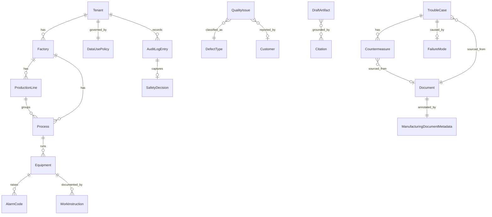

# Phase 1 Data Model: Manufacturing Field Knowledge RAG (Solution Layer)

**Feature**: `002-manufacturing-field-knowledge-rag` | **Date**: 2026-06-19 |
**Source**: [spec.md](./spec.md) Key Entities, [plan.md](./plan.md), [research.md](./research.md)

設計原則（001 を継承）: 全行に `tenant_id`（ハード分離境界, [base:FR-021]）。ACL は 001 の
deny-by-default ACLGrant に従属（新規認可機構を作らない, FR-MFG-013）。検索対象の本文は **001 の
Document/Chunk に取り込み**、製造業メタデータ・承認メタデータは `Document.metadata`/
`Chunk.metadata`(JSON) に格納して 001 metadata filter（[base:FR-010]）で検索する。製造業エンティティ・
DraftArtifact・DataUsePolicy・AuditLogEntry は本 layer の metadata テーブルとして追加し、検索/ACL/
削除は 001 機構をそのまま使う。

> 凡例: 〔base〕= 001 の既存エンティティ（再利用、再定義しない）。〔mfg〕= 本 layer の新規。

---

## A. 001 再利用エンティティ（参照のみ・再定義しない）〔base〕

- **Tenant / Collection / DataSource / Document / Chunk / ACLGrant / IdentityClaims / QueryProfile /
  Query / Answer / Citation / Freshness / EvaluationSet / EvaluationRun / Feedback / CostRecord /
  AuditLog(基盤) / VisualAsset / LayoutRegion / Crop**
  → [001 data-model](../001-rag-platform/data-model.md) を参照。

本 layer は以下の形で 001 を**拡張するのみ**:
- `Document.metadata` / `Chunk.metadata` に **ManufacturingDocumentMetadata**（§B）を格納。
- `Answer` / `Citation` の利用時に **approval_status_at_use** と **obsolete warning** / safety 表示を
  上乗せ（§E SafetyDecision）。回答 status は 001 の `ok|insufficient_evidence|budget_exceeded|
  temporarily_unavailable` を継承し、安全由来ブロックは `insufficient_evidence`（safety）に倒す。
- 001 の基盤 AuditLog を製品レイヤーの **AuditLogEntry**（§G）へ構造化拡張（Base CR-001-A）。

---

## A2. Sync / Processing State（Dagster 差分同期; 001 再利用）〔base + mfg extension〕

以下は 001 の data model を再利用し、002 では製造業メタデータ・承認メタデータの checksum と
KPI materialization 状態を上乗せする。新規の workflow state store は作らない。

### SourceSyncState〔base〕
- `tenant_id`, `collection_id`, `source_id` ごとの cursor/watermark、last_observed_at、
  last_successful_sync_at、last_ingestion_run_id、status、last_error を保持する。
- App admin UI はこの状態を表示し、必要に応じて内部運用者向けに `dagster_run_id` / run URL を参照する。

### SourceDocumentManifest〔base〕
source observation の結果。002 では承認メタデータの変更検知が safety に直結するため、
`approval_metadata_checksum` を必須利用する。
- `tenant_id`
- `collection_id`
- `source_id`
- `source_document_id`
- `source_uri`
- `etag`
- `last_modified`
- `content_checksum`
- `approval_metadata_checksum`
- `deleted_in_source`
- `observed_at`

### DocumentProcessingState〔base〕
文書単位の処理状態。Dagster asset は tenant / collection / source / sync_run 粒度、詳細状態はここに保持する。
- `document_id`
- `source_document_id`
- `content_checksum`
- `parser_version`
- `chunking_config_version`
- `chunking_profile`, `max_chunk_chars`, `chunk_overlap_chars`: document type / metadata に基づく
  chunking profile と overlap。製造業 ingest では `ManufacturingDocumentMetadata.document_kind`
  から profile を選び、Document/Chunk metadata に記録する。
- `embedding_model_version`
- `parse_status`
- `chunk_status`
- `embedding_status`
- `index_status`
- `last_indexed_at`
- `last_error`
- `dagster_run_id` optional

### IngestionRun / AssetMaterializationRef / ReindexPlan〔base〕
- `IngestionRun`: scheduled/manual sync、upload ingest、reindex/backfill、evaluation、KPI materialization の app-facing run。
- `AssetMaterializationRef`: Dagster asset materialization への参照。source of truth ではなく traceability 用。
- `ReindexPlan`: parser/chunking/embedding model migration の backfill 計画。

### 差分判定ルール（002 safety 反映）

- `content_checksum` が変わらなければ parse/chunk/embedding を再実行しない。
- `approval_metadata_checksum` だけ変わった場合は ManufacturingDocumentMetadata / Chunk metadata update と
  safety/index filter update のみ実行する。high-risk approved citation 判定はこの更新後の状態を見る。
- `parser_version` または `chunking_config_version` が変わった場合は reparse/rechunk する。
- `embedding_model_version` が変わった場合は reembedding/backfill 対象にする。
- source から削除された文書は tombstone とし、検索・回答・citation・cache・trouble-cases・draft source selection から即時除外する。
- delete は Dagster の物理 cleanup を待たず、アプリ DB の tombstone で即時効かせる。

---

## B. ManufacturingDocumentMetadata 〔mfg〕

文書メタデータの包括型。001 `Document.metadata`(JSON) に格納し、`Chunk.metadata` へ継承伝播。
検索 metadata filter（[base:FR-010]）と SafetyGate / HighRiskClassifier が参照する。

**製造業タグ**:
- `equipment`(name), `model_no`, `alarm_code`, `defect_type`, `process`(name), `part_no`, `customer`
- `equipment_id`, `process_id`（エンティティFK; 集計・ACL マッピング用）
- `document_type` / `document_kind`: `work_instruction | inspection | quality_report |
  trouble_report | minutes | ledger | drawing | training`

**safety / quality 分類タグ**（HighRiskClassifier 入力, FR-MFG-015）:
- `safety_category`, `quality_category`, `equipment_operation_category`
- `hazard_tags`(list): 例 設備停止/分解/感電/高温/高圧/薬品/重量物/安全装置 等
- `regulation_refs`(list): JIS/ISO/労安法などのレビュー用アンカー。例
  `ISO_12100_2010`, `JIS_B_9700_2013`, `ISO_45001_2018`, `ISO_9001_2015`, `JP_ISHA`。
  `domain/regulations.py` の catalog / 推論ヘルパーで補完できるが、法令適合の断定ではなく
  SME レビュー対象の根拠候補として扱う。

**承認メタデータ**（FR-MFG-004/004a）:
- `approval_status`: `draft | pending_review | approved | obsolete`
- `effective_date`, `approved_by`, `approved_at`, `obsolete_at`, `superseded_by`
- `approval_source`: `imported | workflow`（imported は取り込み元を source of truth とする）

**Validation**:
- `document_type` は列挙値のいずれか必須。
- high-risk 回答で一次根拠に使えるのは `approval_status=approved` ∧ `effective_date` 有効
  （未来でも失効でもない）な文書のみ（FR-MFG-005）。
- `approval_source=imported` のとき承認フィールドは取り込み値を優先、`workflow` のとき本 layer の
  軽量ワークフローで設定。

---

## C. 製造業ドメインエンティティ 〔mfg〕

いずれも `tenant_id` 必須・001 ACL/tombstone に従属する metadata テーブル。本文は 001 Document/Chunk
に存在し、これらは「正規化された製造業メタデータ＋関係」を担う参照層（research R5）。

| エンティティ | 主キー | 主なフィールド / 関係 |
|---|---|---|
| **Factory** | `factory_id` | `tenant_id`, `name`; 1—N ProductionLine/Process/Equipment。ACL/権限領域単位（FR-MFG-013 工場マッピング） |
| **ProductionLine** | `line_id` | `tenant_id`, `factory_id`, `name`; Process を束ねる |
| **Process** | `process_id` | `tenant_id`, `factory_id`, `line_id?`, `process_name`; 関連 Equipment/Part/DefectType。設備領域 ACL マッピング |
| **Equipment** | `equipment_id` | `tenant_id`, `factory_id`, `line_id?`, `process_id?`, `equipment_name`, `model_no`; 関連 AlarmCode/WorkInstruction |
| **AlarmCode** | `alarm_id` | `tenant_id`, `equipment_id`, `code`, `description`; 関連 TroubleCase/対処手順 |
| **Product** | `product_id` | `tenant_id`, `product_name`; 関連 Process/Customer/DefectType |
| **Part** | `part_id` | `tenant_id`, `part_no`; 関連 Equipment/Product |
| **Customer** | `customer_id` | `tenant_id`, `name`（機密度高・ACL 対象）; 関連 Product/QualityIssue |
| **DefectType** | `defect_id` | `tenant_id`, `defect_name`; 関連 Product/Process/QualityIssue |
| **FailureMode** | `failure_mode_id` | `tenant_id`, `name`, `description`（原因）; TroubleCase から参照 |
| **TroubleCase** | `trouble_case_id` | `tenant_id`, `symptom`, `equipment_id?`, `process_id?`, `failure_mode_id?`, `occurred_at`, `source_document_id`(FK→001 Document); 1—N Countermeasure |
| **Countermeasure** | `measure_id` | `tenant_id`, `trouble_case_id`, `description`, **`type`**(reference\|candidate), **`measure_class`**(provisional\|permanent\|unknown), `source_document_id?`（§D 詳細） |
| **WorkInstruction** | `work_instruction_id` | `tenant_id`, `document_id`(FK→001 Document), `equipment_id?`, `process_id?`, 承認メタデータは §B 経由 |
| **InspectionChecklist** | `checklist_id` | `tenant_id`, 取り込み元 `document_id?` または DraftArtifact 由来 `artifact_id?`（draft） |
| **QualityIssue** | `quality_issue_id` | `tenant_id`, `defect_id`, `product_id?`, `customer_id?`, 原因/対策, `source_document_id?` |
| **TrainingMaterial** | `training_id` | `tenant_id`, 取り込み元 `document_id?` または DraftArtifact 由来 `artifact_id?`（draft） |

**Validation**:
- 全エンティティ `tenant_id` 必須、tenant 越え参照禁止（001 tenant 分離）。
- `source_document_id` は 001 Document を指し、ACL/tombstone は Document に従う（権限外・削除済みは
  結果に出さない）。
- Customer は機密度が高く ACL 対象（SC-MFG-008）。

---

## D. Countermeasure の 2 軸（FR-MFG-008/009, G4）

`type` と `measure_class` を**分離**して保持する。

- `type`（表示 / evidence 区分）: `reference | candidate` — 参考/候補。**正式手順ではない**。
- `measure_class`（対策の性質）: `provisional`（暫定）| `permanent`（恒久）| `unknown`（分類不明）。

**Validation / 表示ルール**:
- 過去 TroubleCase 由来の対策は、`measure_class=permanent` であっても**正式作業指示として断定せず**
  「過去事例に基づく候補・参考」として表示する（Hard Rule 4, FR-MFG-009）。
- 類似トラブル一覧は暫定（provisional）と恒久（permanent）を**分けて表示**する（G4, FR-MFG-008）。

---

## E. SafetyDecision / HighRiskClassification（value object, 監査に保存）〔mfg〕

回答経路で生成され、AuditLogEntry / telemetry に記録される判定結果（永続は audit、回答には表示分のみ）。

**HighRiskClassification**（FR-MFG-015）:
- `is_high_risk`: bool（OR 判定。迷えば true = fail-safe）
- `reason_codes`: list（例 equipment_stop/disassembly/electric_shock/high_temp/high_pressure/
  chemical/heavy_object/safety_device/quality_judgment/shipment_decision/customer_impact/
  corrective_action ／ metadata 由来 safety_category 等）
- `classification_source`: `metadata | rule | keyword | llm`（いずれか該当で high-risk）

**SafetyDecision**（FR-MFG-005/006/007, FR-MFG-030）:
- `blocked`: bool（断定を止めたか）
- `safety_block_reason`: `approved_citation_missing | insufficient_evidence | other_block | null`
  — **相互排他 1 コード**。判定優先順 (1)approved_citation_missing → (2)insufficient_evidence →
  (3)other_block で 1 件に正規化（1 ブロック＝主因 1 つ, FR-MFG-030）。
- `obsolete_warning`: bool（obsolete 文書参照時 true・警告表示必須, FR-MFG-006）
- `requires_onsite_confirmation`: bool（危険作業時「現場責任者/有資格者の確認が必要」表示, FR-MFG-007）
- `approval_status_at_use`: 使用根拠の承認状態スナップショット（回答・監査に伝播）

**Validation**:
- `is_high_risk=true` かつ approved・有効な引用が無い → `blocked=true`,
  `safety_block_reason=approved_citation_missing`、回答は `insufficient_evidence`（safety）。断定禁止。
- obsolete のみが根拠 → 一次根拠にしない（SC-MFG-011）、`obsolete_warning=true`。
- draft 文書は policy 許可時のみ参考利用・正式根拠にしない（FR-MFG-006）。

---

## F. DraftArtifact 〔mfg〕（FR-MFG-010/010a/010b, G1）

AI 生成物。**必ず `status=draft` で作成され自動 approved にならない**。

- `artifact_id` (PK), `tenant_id`, `collection_id?`
- `type`: `checklist | trouble_report | quality_report | training | faq`
- `status`: `draft | in_review | approved | rejected | archived`（**既定 draft**）
- 生成根拠（audit trail, FR-MFG-010b）: `source_citations`(list of Citation 参照),
  `source_document_ids`(list), `template_id`, `created_by`(生成者: ai|user), `created_at`,
  `audit_log_ref`
- レビュー（FR-MFG-010a）: `reviewer_id`, `reviewer_role | reviewer_group`, `assigned_at`,
  `reviewed_at`, `review_comment`, `approval_decision`, `review_status`

**State Transition**:
```
draft → in_review → approved
                 ├→ rejected
                 └→ archived
draft → archived
```
- AI は `draft` 以外に直接遷移できない（自動 approved 禁止, Hard Rule 1, SC-MFG-007）。
- `approved` 遷移は reviewer（単一 or group）の明示判断のみ（多段承認・電子署名なし）。
- 安全項目は承認済み根拠が無ければ draft 上でも断定しない（FR-MFG-011, FR-MFG-005 準拠）。
- FAQ も他 draft と同列: reviewer approve まで draft 扱い・正式公開物にしない（G1）。

**Validation**:
- 生成時 `status=draft` 強制、`created_by=ai` の自動 approved を禁止（制約）。
- 全 transition は AuditLogEntry に記録（FR-MFG-021）。

---

## G. DataUsePolicy 〔mfg〕（FR-MFG-016〜020/029, Governance, GQ1/GQ2）

tenant 単位のデータ利用方針。営業・管理画面・監査で説明可能（`policy_version` 必須）。

- `tenant_id` (PK), `no_train_default`: bool（**true 固定既定**, FR-MFG-016）
- `training_opt_in`: bool（既定 **false**; true 化は admin 明示 opt-in＋別契約必須, FR-MFG-018）
- `opt_in_contract_ref`: str?（opt-in 時の契約参照）
- `provider_no_train_required`: bool（既定 **true**, FR-MFG-017）
- `no_train_fallback`: `block`（**GQ1 確定**; no-train 非保証 capability は既定利用不可）
- `retention_period_customer_days`: int（**既定 365**, GQ2; tenant 上書き可, ガイド 30–3650）
- `retention_period_audit_days`: int（**既定 365**, GQ2; tenant 上書き可, ガイド 30–3650）
- `export_enabled`: bool, `policy_version`: str, `updated_by`, `updated_at`

**Validation / 適用**:
- `training_opt_in=false`（既定）では顧客データを学習・横断改善・別テナント改善に使用しない
  （SC-MFG-009 = 違反 0）。
- `provider_no_train_required=true` かつ ある capability に no-train 保証 provider が無い →
  `no_train_fallback=block` により当該 capability 利用不可（`temporarily_unavailable`, 推測回答なし）。
- retention 失効データは 001 tombstone/カスケード [base:FR-008]＋Base CR-001-C で削除。
- policy 変更は AuditLogEntry に記録（FR-MFG-019/021）。

---

## H. AuditLogEntry 〔mfg〕（FR-MFG-021〜023, Base CR-001-A, telemetry の単一真実源）

tenant-scoped・tamper-evident な構造化監査記録。001 基盤 AuditLog を製品レイヤーへ拡張。

- `log_id` (PK), `tenant_id`, `timestamp`, `request_id | trace_id`
- actor: `actor_id`, `actor_role | actor_group`, `app_id | api_client_id`,
  `source_ip | client_metadata`(取得可能な範囲)
- **集計用 actor 組織コンテキスト**（FR-MFG-030）: `factory_id`, `department_id`
  （部署=base ACL group/role 由来、工場=Factory 由来）
- action: `action`, `resource_type`, `resource_id`, `decision`, `reason`, `policy_version`
- 安全/承認スナップショット: `high_risk_classification_result`, `safety_block_reason`
  (`approved_citation_missing | insufficient_evidence | other_block`), `approval_status_at_use`
- 根拠参照: `citation_ids | document_ids_used`（**参照IDのみ**）
- 完全性: `prev_hash` / `entry_hash`（hash chain による tamper-evidence; Base CR-001-A）

**記録対象イベント**（FR-MFG-021, 全カテゴリ）:
document upload/ingest/parse/metadata enrichment、ManufacturingDocumentMetadata CRUD、approval_status
変更 / external approval import、DraftArtifact 生成 / review assignment / status transition、high-risk
query 判定 / SafetyGate 判断 / approved-citation 必須判定 / obsolete・draft warning、answer generation /
citation access / search query / insufficient evidence、feedback / low rating / dashboard access /
KPI calc・export、ACL denied / tenant isolation denied、admin setting（no-train/retention/provider）
変更、deletion / tombstone / cache invalidation。

**Validation（hard）**:
- **PII/secret/機密本文を保存しない**（参照IDで追跡, SC-MFG-010 = PII 混入 0）。001 redaction を再利用。
- **tenant 越え参照禁止**（001 tenant 分離を再利用）。
- 規定イベントの記録率 **100%・欠落 0**（SC-MFG-010）。
- telemetry/KPI は本エントリから**導出**し二重カウントしない（FR-MFG-030）。

---

## I. Safety Telemetry / PoC KPI（集計ビュー, FR-MFG-028/030, G2/G3）

AuditLogEntry を**単一真実源**として集計する派生ビュー（独立保存しても audit から導出）。

**Safety Telemetry**（FR-MFG-030）:
- `high_risk_query_count`: HighRiskClassification.is_high_risk=true の件数
- `safety_gate_block_count`: SafetyDecision.blocked=true の件数。内訳は **相互排他**:
  `approved_citation_missing` / `insufficient_evidence` / `other_block`
- 集計軸: `tenant | collection | factory | department | time_range`（hourly/daily/custom 可変）
- retention は DataUsePolicy.retention_period_audit_days に従う

**PoC KPI**（FR-MFG-028）:
`self_resolution_rate`, `average_time_to_answer`(p50/p95), `grounded_answer_rate`,
`insufficient_evidence_rate`, `low_rating_rate`, `unanswered_question_count`,
`frequently_referenced_documents`, `obsolete_document_candidates`, `expert_interruption_reduction`,
`high_risk_query_count`, `safety_gate_block_count`。001 evaluation/metrics（[base:FR-017/026]）で計測・
Dagster `manufacturing_dashboard_metrics` asset で daily/manual materialize し、`materialized_at`,
`source_ingestion_run_id`, `dagster_run_id?` を保存して export。

---

## Relationships (ERD, mfg 追加分)



> Document / Chunk / Citation / ACLGrant は 001〔base〕。本図は mfg 追加分と base への接続のみ示す。

---

## State Transitions（まとめ）

### 承認ライフサイクル（ManufacturingDocumentMetadata, FR-MFG-004）
```
draft → pending_review → approved → obsolete
                         (approved → superseded → obsolete も可; superseded_by 設定)
imported approval: 取り込み元の承認状態を source of truth として直接設定（workflow を経由しない）
```

### DraftArtifact（§F 参照）
```
draft → in_review → approved | rejected | archived ; draft → archived
（AI は draft 以外へ自動遷移しない; approved は reviewer のみ）
```

---

## Validation Rules サマリ（spec 由来・hard gate）

- 全 mfg テーブルに `tenant_id` 必須・tenant 越え参照禁止（001 継承, SC-MFG-008）。
- SourceDocumentManifest / DocumentProcessingState の差分判定を 001 と共有し、approval metadata-only 変更では parse/chunk/embedding を再実行せず metadata/safety/index filter のみ更新する。
- high-risk 回答は approved ∧ 有効引用が無ければ断定しない（FR-MFG-005/007, **SC-MFG-006 = 0**）。
- AI 生成物は draft 以外で自動確定しない（**SC-MFG-007 = 0**）。
- obsolete/draft を正式根拠として断定回答に使わない（FR-MFG-006, **SC-MFG-011 = 0**）。obsolete は
  warning 必須。
- 過去事例由来の対策は permanent でも候補・参考表示（Hard Rule 4, FR-MFG-009）。
- no-train: opt-in 無しの学習利用 0（**SC-MFG-009 = 0**）。no-train 非保証 capability は block（GQ1）。
- audit: 規定イベント記録率 100%・PII 混入 0（**SC-MFG-010**）。telemetry は audit 由来で二重計上なし。
